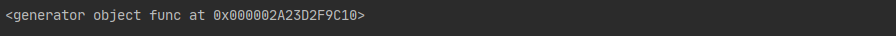
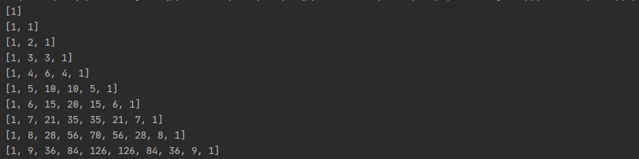
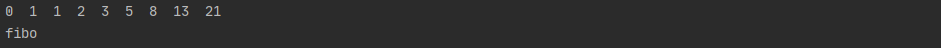
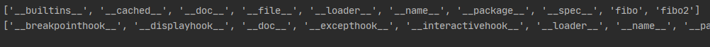
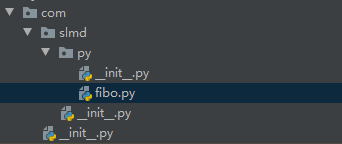
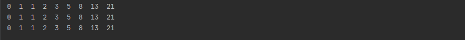

[目录](#Python笔记)

[一. 介绍](#一介绍)

[二、基本数据类型](#二基本数据类型)

[三、其他数据类型](#三其他数据类型)

[四、条件语句和循环语句](#四条件语句和循环语句)

[五、函数](#五函数)

[六、迭代器和生成器](#六迭代器和生成器)

[七、面向对象](#七面向对象)

[八、模块与包](#八模块与包)

# Python笔记

## 一、介绍

## 二、基本数据类型

### 1. 字符串-String

~~~python
str = 'aaa'		# 单引号
str2 = "bbb"	# 双引号
str3 = '''line1
line2
line3'''		# 三引号，表示多行内容
~~~


### 2. 整数-Int

~~~python
num1 = 1	# Python可以处理任意大小的整数，当然包括负整数，在程序中的表示方法和数学上的写法一模一样
~~~


### 3. 浮点数-Float

>  浮点数也就是小数 。 整数和浮点数在计算机内部存储的方式是不同的，整数运算永远是精确的，而浮点数运算则可能会有四舍五入的误差 


### 4. 布尔值-Boolean

>  布尔值和布尔代数的表示完全一致，一个布尔值只有`True`、`False`两种值，要么是`True`，要么是`False`，在Python中，可以直接用`True`、`False`表示布尔值（请注意大小写），也可以通过布尔运算计算出来 ，比如：`3>2`


### 5. 空值-None

> 空值是Python里一个特殊的值，用`None`表示。`None`不能理解为`0`，因为`0`是有意义的，而`None`是一个特殊的空值。


### 6. 基本数据类型的转换

| 方法                   | 说明                                                  |
| ---------------------- | ----------------------------------------------------- |
| int(x [,base ])        | 将x转换为一个整数                                     |
| float(x )              | 将x转换到一个浮点数                                   |
| complex(real [,imag ]) | 创建一个复数                                          |
| str(x )                | 将对象 x 转换为字符串                                 |
| repr(x )               | 将对象 x 转换为表达式字符串                           |
| eval(str )             | 用来计算在字符串中的有效 Python 表达式,并返回一个对象 |
| tuple(s )              | 将序列 s 转换为一个元组                               |
| list(s )               | 将序列 s 转换为一个列表                               |
| chr(x )                | 将一个整数转换为一个字符                              |
| unichr(x )             | 将一个整数转换为 Unicode 字符                         |
| ord(x )                | 将一个字符转换为它的整数值                            |
| hex(x )                | 将一个整数转换为一个十六进制字符串                    |
| oct(x )                | 将一个整数转换为一个八进制字符串                      |


### 7. 变量

>  变量是用一个变量名表示，可以是任意数据类型，变量名必须是大小写英文、数字和下划线（_）的组合，且不能用数字开头 ，如：`num = 88`


## 三、其他数据类型

### 1. 列表-list

> List 是一种有序的集合，可以随时添加和删除其中的元素 

+ 基本用法

~~~python
# 创建List
list = [11,"nihao",True,99.99]
# 根据下标访问
list[1] = 'hello'
print(list[1])
# 使用append()方法增加集合项
list.append('派生')
print(list)
# 删除元素
del list[3]
print(list)
~~~

+ List（列表）运算符

| Python 表达式                | 结果                         | 描述                 |
| ---------------------------- | ---------------------------- | -------------------- |
| len([1, 2, 3])               | 3                            | 计算元素个数         |
| [1, 2, 3] + [4, 5, 6]        | [1, 2, 3, 4, 5, 6]           | 组合                 |
| ['Hi!'] * 4                  | ['Hi!', 'Hi!', 'Hi!', 'Hi!'] | 复制                 |
| 3 in [1, 2, 3]               | True                         | 元素是否存在于列表中 |
| for x in [1, 2, 3]: print x, | 1 2 3                        | 迭代                 |

+ List （列表）函数&方法

| 函数&方法               | 描述                                                         |
| ----------------------- | ------------------------------------------------------------ |
| len(list)               | 列表元素个数                                                 |
| max(list)               | 返回列表元素最大值                                           |
| min(list)               | 返回列表元素最小值                                           |
| list(seq)               | 将元组转换为列表                                             |
| list.append(obj)        | 在列表末尾添加新的对象                                       |
| list.count(obj)         | 统计某个元素在列表中出现的次数                               |
| list.extend(seq)        | 在列表末尾一次性追加另一个序列中的多个值（用新列表扩展原来的列表） |
| list.index(obj)         | 从列表中找出某个值第一个匹配项的索引位置                     |
| list.insert(index, obj) | 将对象插入列表                                               |
| list.pop(obj=list[-1])  | 移除列表中的一个元素（默认最后一个元素），并且返回该元素的值 |
| list.remove(obj)        | 移除列表中的一个元素（参数是列表中元素），并且不返回任何值   |
| list.reverse()          | 反向列表中元素                                               |
| list.sort([func])       | 对原列表进行排序                                             |


### 2. 元组-tuple

>  另一种有序列表叫元组：tuple。tuple和list非常类似，但是tuple一旦初始化就不能修改 

+ 基本用法

~~~python
# 创建元组
list = [121, 221]
tuple = (list, 'hello', '你好', False)
# 根据索引获取元素
print(tuple[2])
# 元组无法进行修改，但可以对元组里指定的对象值进行修改，从而影响元组的值
list[0] = 122
list[1] = 222
print(tuple)
# 删除元组：无法删除元素，只能整个元组删除
del tuple
print(tuple)
~~~

+ tuple （元组）运算符

| Python 表达式                | 结果                         | 描述         |
| ---------------------------- | ---------------------------- | ------------ |
| len((1, 2, 3))               | 3                            | 计算元素个数 |
| (1, 2, 3) + (4, 5, 6)        | (1, 2, 3, 4, 5, 6)           | 连接         |
| ('Hi!',) * 4                 | ('Hi!', 'Hi!', 'Hi!', 'Hi!') | 复制         |
| 3 in (1, 2, 3)               | True                         | 元素是否存在 |
| for x in (1, 2, 3): print(x) | 1 2 3                        | 迭代         |

+ 元组内置函数

| 方法       | 描述                 |
| ---------- | -------------------- |
| len(tuple) | 计算元组元素个数     |
| max(tuple) | 返回元组中元素最大值 |
| min(tuple) | 返回元组中元素最小值 |
| tuple(seq) | 将列表转换为元组     |


### 3. 字典-dict

> dict全称dictionary，在其他语言中也称为map，使用键-值（key-value）存储，具有极快的查找速度 

+ 基本用法

~~~python
# dict的创建
dict = {'name': 'Pop', 'age': 17, 'address': '上海'}
# 访问dict
print(dict.get('name'))
print(dict['address'])
# 更新dict
dict['name'] = '小花'     # 修改元素
dict['flag'] = True      # 新增元素
print(dict)
# 删除dict
del dict['flag']    # del关键字删除dist的一个元素
print(dict)
dict.clear()    # 清空dict
print(dict)
del dict        # del关键字删除dict
print(dict)
~~~

+ dict （字典） 的函数和方法

| 方法和函数     | 描述                                             |
| -------------- | ------------------------------------------------ |
| len(dict)      | 计算字典元素个数                                 |
| str(dict)      | 输出字典可打印的字符串表示                       |
| type(variable) | 返回输入的变量类型，如果变量是字典就返回字典类型 |
| dict.clear()   | 删除字典内所有元素                               |
| dict.copy()    | 返回一个字典的浅复制                             |
| dict.values()  | 以列表返回字典中的所有值                         |
| popitem()      | 随机返回并删除字典中的一对键和值                 |
| dict.items()   | 以列表返回可遍历的(键, 值) 元组数组              |

+ dict（字典）使用时注意的事项

> 1.  dict （字典）是不允许一个键创建两次的，但是在创建 dict （字典）的时候如果出现了一个键值赋予了两次，会以最后一次赋予的值为准 
> 2.  dict （字典）键必须不可变，可是键可以用数字，字符串或元组充当，但是就是不能使用列表 
> 3.   dict 内部存放的顺序和 key 放入的顺序是没有任何关系 
>
> **和 list 比较，dict 有以下几个特点：**
>
> - 查找和插入的速度极快，不会随着key的增加而变慢
> - 需要占用大量的内存，内存浪费多
>
> **而list相反：**
>
> - 查找和插入的时间随着元素的增加而增加
> - 占用空间小，浪费内存很少


### 4. set

>   set和其他语言类似, 是一个无序不重复元素集 

~~~python
# 创建Set
set  = set([1,2,3,4,4])
print(set)
# 添加元素
set.add('add')
print(set)
# 删除元素
set.remove(4)
print(set)
~~~


## 四、条件语句和循环语句

### 1. 条件语句

>  非零数值、非空字符串、非空 list 等，判断为 True，否则为 False 

~~~python
# if语句
score = 90
if 60 < score < 80:
    print('及格')
elif score > 80:
    print('优秀')
else:
    print('不及格')
~~~


### 2. 循环语句

+ 循环控制语句

| 循环控制语句 | 描述                                                         |
| ------------ | ------------------------------------------------------------ |
| break        | 在语句块执行过程中终止循环，并且跳出整个循环                 |
| continue     | 在语句块执行过程中终止当前循环，跳出该次循环，执行下一次循环 |
| pass         | pass 是空语句，是为了保持程序结构的完整性                    |

+ **for循环**

~~~python
# for 循环
arr = [121, 333, 555, 765]
for item in arr:
    print(item)
# 配合range()函数使用
for item in range(4):   # range(x,y)生成一个从x到y的整数序列，range(4)相当等于range(0,4)
    print(item)
~~~

+ **while循环**

~~~python
# while 循环
count = 0
while count<5:
    print(count)
    count = count +1
~~~

> for 和 while 循环的区别：
>
> - for 循环主要用在迭代可迭代对象的情况。
> - while 循环主要用在需要满足一定条件为真，反复执行的情况。 （死循环+break 退出等情况。）
> - 部分情况下，for 循环和 while 循环可以互换使用（嵌套循环）。


## 五、函数

### 1. 定义函数

```python
def 函数名(参数1，参数2....参数n):
    函数体
    return 语句
```

> 函数定义步骤：
>
> - 函数代码块以 def 关键词开头，后接函数标识符名称和圆括号()
> - 任何传入参数和自变量必须放在圆括号中间。圆括号之间可以用于定义参数
> - 函数的第一行语句可以选择性地使用文档字符串（用于存放函数说明）
> - 函数内容以冒号起始，并且缩进
> - return [表达式] 结束函数，选择性地返回一个值给调用方。不带表达式的 return 相当于返回 None。

**示例：**

~~~python
# 定义函数
def sum(num1, num2):
    return num1 + num2
# 调用函数
print(sum(4,6))
~~~


### 2. 函数的返回值

+ **函数没有返回值（`return`）的情况下，默认返回`None`**

~~~python
def sum(num1, num2):
    print(num1 + num2)
# 没有返回值（return）=>返回None
print(sum(1, 2))
# 不传参数=>报错TypeError
print(sum())
~~~

**执行结果：**


+ **函数返回多个值**

~~~python
def sum_sub(num1, num2):
    ret1 = num1 + num2
    ret2 = num1 - num2
    return ret1, ret2
print(sum_sub(67, 18))
# 返回多个值时会自动将所有值转化为一个元组
print(isinstance(sum_sub(67, 18), tuple))
~~~

**执行结果：**


### 3. 函数的参数

>  主要的参数类型有：默认参数、关键字参数（位置参数）、不定长参数。 

+ **默认参数**

~~~python
def print_user_info(name, age, gender='男'):
    print('姓名：{0}，年龄：{1}，性别：{2}'.format(name, age, gender), end='------')
# 调用打印用户信息函数
print_user_info('花花', 12)
~~~

**执行结果：**


> 1.  **只有在形参表末尾的那些参数可以有默认参数值，比如：def func(a=1, b) 是无效的** 
> 2.  **默认参数的值是不可变的对象，比如None、True、False、数字或字符串，不能为list等可变对象** 

~~~python
# 函数参数为list
def print_info(a, b=[]):
    print(b)
    return b;
result = print_info(1)
result.append('error')
print_info(2)		# 从外部改变b参数的值之后再次调用函数会发现之前添加的值还在list内
~~~

**执行结果：**


+ **关键字参数（位置参数） **

>   Python 中，可以通过参数名来给函数传递参数，而不用关心参数列表定义时的顺序，这被称之为关键字参数 
>
> 使用关键参数有两个优势 ：
>
> - 由于我们不必担心参数的顺序，使用函数变得更加简单了。
> - 假设其他参数都有默认值，我们可以只给我们想要的那些参数赋值

~~~python
# 关键参数
def print_user_info(name, age, gender='男'):
    print('姓名：{0}，年龄：{1}，性别：{2}'.format(name, age, gender), end='------')
print_user_info(age=88, name='小草')
~~~

**执行结果：**


+ **不定长参数**

>  Python 提供了一种元组的方式来接受没有直接定义的参数。这种方式在参数前边加星号 `*` 

~~~python
# 不定长参数
def print_user_info(name, age, gender='男', *hobby):
    print('姓名：{0}，年龄：{1}，性别：{2}'.format(name, age, gender), end='------')
    print('兴趣：{}'.format(hobby))
print_user_info('小明', 12, '女', '象棋', '画画', '种草')
~~~

**执行结果：**


> 上面的方式由于无法使用**关键字参数**去定位`*hobby`所以默认值参数也会失效，想要`hobby`支持关键字参数需要使用`**`的前缀，比如：

~~~python
def print_user_info(name, age, gender='男', **hobby):
    print('姓名：{0}，年龄：{1}，性别：{2}'.format(name, age, gender), end='------')
    print('兴趣：{}'.format(hobby))
# hobby使用tuple（元组）的类型去传参
print_user_info('小明', 12, hobby=('象棋', '画画', '种草'))
~~~

**执行结果：**


> 由打印的格式可以看出， `*hobby`是可变参数，且 hobby其实就是一个 tuple （元祖），`**hobby`是关键字参数，且 hobby 就是一个 dict （字典） 

+ **只接受关键字参数**

>  将参数放到某个`*`参数或者单个`*`后面就能强制让参数使用关键字方法赋值

~~~python
# 只接受关键字参数
def print_user_info(name, *, age, gender='男'):
    print('姓名：{0}，年龄：{1}，性别：{2}'.format(name, age, gender), end='------')
# age,gender必须使用关键字参数的方式赋值，否则将会报错
print_user_info('小凯', age=11)
~~~

**执行结果：**


### 4. 函数传值问题

> 感觉没啥好记的，这里留个[链接](https://github.com/TwoWater/Python/blob/master/Article/PythonBasis/python6/4.md)，后续实际遇到这种问题再说


### 5. 匿名函数

> python 使用 lambda 来创建匿名函数（lambda函数表达式），也就是不再使用 def 语句这样标准的形式定义一个函数。 
>
>匿名函数主要有以下特点：
>
>- lambda 只是一个表达式，函数体比 def 简单很多。
>- lambda 的主体是一个表达式，而不是一个代码块。仅仅能在 lambda 表达式中封装有限的逻辑进去。
>- lambda 函数拥有自己的命名空间，且不能访问自有参数列表之外或全局命名空间里的参数。
>
>**基本语法：**
>
>```python
>lambda 参数列表:返回值
>```

~~~python
# 匿名函数
sum = lambda num1, num2: num1 + num2
# 一般不用把lambda函数赋给一个变量的方式调用
print(sum(1, 4))
# 直接加括号调用(一般不这么用)
print(( lambda num1, num2: num1 + num2)(12,4))
# 使用filter(function,arr)函数举例
arr = filter(lambda i: i % 2 == 0, [1, 4, 6, 7, 9, 10])
print(list(arr))
# 使用map(function,arr)函数举例
l = [1, 2, 3, 4, 5, 6, 7, 8, 9]
r = map(lambda i: i + 1, l)
print(list(r))
~~~

>  注意：**尽管 lambda 表达式允许你定义简单函数，但是它的使用是有限制的。 你只能指定单个表达式，它的值就是最后的返回值。也就是说不能包含其他的语言特性了， 包括多个语句、条件表达式、迭代以及异常处理等等。** 

**特殊情况：**

~~~python
num2 = 100
sum1 = lambda num1: num1 + num2;

num2 = 10000
sum2 = lambda num1: num1 + num2;

print(sum1(1))
print(sum2(1))
~~~

**运行结果：**


> **这主要在于 lambda 表达式中的 num2 是一个自由变量，在运行时绑定值，而不是定义时就绑定，这跟函数的默认值参数定义是不同的。所以建议还是遇到这种情况还是使用第一种解法。**


### 6. 作用域（scope）

+ **全局作用域**

> 1. 全局作用域在程序（.py文件）执行时创建，在程序结束时销毁
> 2. 在函数以外的区域都是全局作用域
> 3. 在全局作用域中定义的变量，都属于全局变量，全局变量可以在程序的任意位置被访问

+ **函数作用域**

> 1. 函数作用域在函数调用时创建，调用结束时销毁
> 2. 函数每调用一次就会产生一个新的函数作用域
> 3. 在函数作用域中定义的变量，都是局部变量，只能在函数内部被访问

+ **变量的查找**

> 1. 当使用变量时，会优先在当前作用域寻找该变量，如果有则使用，没有则继续去上一级作用域寻找
> 2. 在函数中为变量赋值时，默认都是局部变量。如果需要在函数内部修改全局变量，则需要使用`global`关键字来声明变量

~~~python
# 在函数内部修改全局变量
a = 20
def func():
    global a	# 先声明a是全局变量
    a = 10		# 再给a赋值
    print('函数内部，a =', a)
func()
print('函数外部，a =', a)
~~~

执行效果：

~~~python
函数内部，a = 10
函数外部，a = 10
~~~

获取当前命名空间和全局命名空间：

~~~python
# 获取当前的命名空间，返回一个dict
locals()
# 获取全局命名空间
global()
~~~


### 7.  装饰器

~~~python
def begin_end(func):
    def new_func(*args, **kwargs):
        print('开始执行函数')
        func(*args, **kwargs)
        print('执行函数结束')

    return new_func


@begin_end
def print_hello(text):
    print('hello~~~~~~~~~~~' + text)


print_hello('芜湖')
~~~

>装饰器作用：
>
>1. 通过装饰器，可以在不修改原来函数的情况下对函数进行扩展，通常用于开发中对功能的扩展。
>2. 可以为同一个函数指定多个装饰器，此时函数将会按照从内向外的顺序被装饰。
>3. 遵守开闭原则。
>
>`*args, **kwargs`表示接受所有的位置参数和关键字参数


## 六、迭代器和生成器

### 1. 迭代

>  在 Python 中，给定一个 list 或 tuple，我们可以通过 for 循环来遍历这个 list 或 tuple ，这种遍历就是迭代。 
>
> 但Python 的 `for` 循环抽象程度要高于 Java 的 `for` 循环， 因为 Python 的 `for` 循环不仅可以用在 list 或tuple 上，还可以作用在其他可迭代对象上。
>
> 也就是说，**只要是可迭代的对象，无论有没有下标，都是可以迭代的**，迭代是 Python 最强大的功能之一，是访问集合元素的一种方式。

~~~python
# 遍历tuple
tuple = (99, 'hello', True)
for t in tuple:
    print(t)
# 遍历字符串
for x in 'hello':
    print(x, end='------')
~~~

打印结果如下：

~~~python
99
hello
True
h------e------l------l------o------
~~~


### 2. 迭代器

> + 迭代器是一个可以记住遍历的位置的对象
> + 迭代器对象从集合的第一个元素开始访问，直到所有的元素被访问完结束。
> + 迭代器只能往前不会后退。
> +   迭代器有两个基本的方法：iter() 和 next(),且字符串，列表或元组对象都可用于创建迭代器，迭代器对象可以使用常规 for 语句进行遍历，也可以使用 next() 函数来遍历。 

~~~python
# 迭代器
# 1. 字符串创建迭代器
str1 = 'cold_boy'
iter_str = iter(str1)
# 2. list创建迭代器
list1 = [1, 2, 3, 56, 66]
iter_list = iter(list1)
# 3.tuple创建迭代器
tuple1 = (11, 'kkk', True)
iter_tuple = iter(tuple1)

# for 遍历
for s in iter_str:
    print(s, end='------')

# 使用next遍历
print()
print(next(iter_tuple))
print(next(iter_tuple))
print(next(iter_tuple))
~~~

执行结果：


### 3. 切片

> 对于取list或tuple取指定索引范围的操作，用循环十分繁琐，因此，Python提供了切片（Slice）操作符，能大大简化这种操作。

~~~python
# 1. 取list前三个值
list = list(range(30))
l1 = list[0:3]
print(l1)
# 2. 从第一个索引开始的情况,0可省略
l2 = list[:3]
print(l2)
# 3. 用负数作为索引（最后一个数是-1）
l3 = list[-5:]
print(l3)
# 4. 取索引为10-15的值
l4 = list[10:15]
print(l4)
# 5. 前10个数，每隔两个取一次
l5 = list[:10:2]
print(l5)
# 6. 所有数，每隔5个取一次
l6 = list[::5]
print(l6)
# 7. 复制一个list
l7 = list[:]
print(l7)
# tuple、字符串也可以进行切片操作

~~~

执行结果：


### 4. list生成式

+ 利用 `range(x,y)` 创建list

~~~python
list1=list ( range (1,31) )
print(list1)
~~~

执行结果：

```python
[1, 2, 3, 4, 5, 6, 7, 8, 9, 10, 11, 12, 13, 14, 15, 16, 17, 18, 19, 20, 21, 22, 23, 24, 25, 26, 27, 28, 29, 30]
```

打印九九乘法表：

~~~python
print('\n'.join([' '.join ('%dx%d=%2d' % (x,y,x*y)  for x in range(1,y+1)) for y in range(1,10)]))
~~~

执行结果：


+ **list生成式的创建**

list 生成式的语法为：

```python
[expr for iter_var in iterable] 
[expr for iter_var in iterable if cond_expr]
```

> 第一种语法：首先迭代 iterable 里所有内容，每一次迭代，都把 iterable 里相应内容放到iter_var 中，再在表达式中应用该 iter_var 的内容，最后用表达式的计算值生成一个列表。
>
> 第二种语法：加入了判断语句，只有满足条件的内容才把 iterable 里相应内容放到 iter_var 中，再在表达式中应用该 iter_var 的内容，最后用表达式的计算值生成一个列表。

~~~python
# 第一种：list的元素为遍历range函数的值加1得来
list1 = [x + 1 for x in range(30)]
print(list1)
# 第二种：list的元素为遍历range函数的值加1得来，并且遍历的值必须为偶数
list2 = [x + 1 for x in range(30) if x % 2 == 0]
print(list2)
~~~

执行结果：


### 5. 生成器

> 如果列表元素可以按照某种算法推算出来，这种边循环边计算的机制，成为**生成器：generator**

+ **生成器的创建**

> 最简单最简单的方法就是把一个列表生成式的 `[]` 改成 `()`

~~~python
# 生成器创建
gen = (x * x for x in range(10))
print(gen)
~~~

执行结果：

~~~python
<generator object <genexpr> at 0x000001A77D599C10>
~~~

> 创建 List 和 generator 的区别仅在于最外层的 `[]` 和 `()` 。
>
> 但是生成器并不真正创建数字列表， 而是返回一个生成器，这个生成器在每次计算出一个条目后，把这个条目“产生” ( yield ) 出来。
>
> 生成器表达式使用了“惰性计算” ( lazy evaluation，也有翻译为“延迟求值”，我以为这种按需调用 call by need 的方式翻译为惰性更好一些)，只有在检索时才被赋值（ evaluated ），所以在列表比较长的情况下使用内存上更有效。

+ **遍历生成器的元素**

`for` 循环和 `next()`函数都可以遍历生成器

~~~python
# 遍历生成器
gen = (x * x for x in range(10))
for g in gen:
    print(g, end='-')
~~~

执行结果：

~~~python
0-1-4-9-16-25-36-49-64-81-
~~~

+ **以函数的形式实现生成器**

> 生成器也是一种迭代器，但是你只能对其迭代一次。  这是因为它们并没有把所有的值存在内存中，而是在运行时生成值。你通过遍历来使用它们，要么用一个“for”循环，要么将它们传递给任意可以进行迭代的函数和结构。 

实现一个简单的函数生成器：

~~~python
def func():
    for i in range(100):
        yield i
print(func())
~~~

执行结果：



> ` yield `关键字：
>
> 1. `yield`相当等于`return`，会将程序的某个值返回，返回后程序就不会再继续运行下去了
> 2. 有`yield`关键字的函数并不会真正执行，而是会得到一个函数生成器
> 3. 可以使用迭代或者next()方法执行`yield`的生成器
>
> [参考资料](https://blog.csdn.net/mieleizhi0522/article/details/82142856)

用函数实现一个计算斐波那契数列的生成器：

> 生成器最好的使用场景应该是：你不想同一时间将所有计算出来的大量结果集分配到内存当中，特别是结果集里还包含循环。使用生成器的话可以一边计算一边生成数据，减少不必要的资源消耗

~~~python
# 以函数实现一个斐波那切数列的生成器
def fibon(n):
    a = b = 1
    for i in range(n):
        yield a
        a, b = b, a + b
for x in fibon(100000):
    print(x)
~~~


打印杨辉三角：

~~~python
def triangles(n):  # 杨辉三角形
    L = [1]
    while True:
        yield L
        L.append(0)
        L = [L[i - 1] + L[i] for i in range(len(L))]


n = 0
for t in triangles(10):  # 直接修改函数名即可运行
    print(t)
    n = n + 1
    if n == 10:
        break
~~~

执行结果：




### 6. `sort()`和`sorted()`

+ `sort()`

> 对列表中元素进行排序，默认是直接比较列表中元素的大小，但`sort()`可以接受一个关键字参数`key`，`key`需要一个函数作为参数，每一个列表中的元素都会作为参数来调用函数，并使用函数的返回值来比较元素大小

~~~python
list = ['bbb', 'aa', 'eeeee', 'vvvvvvvv', 'llll']
list.sort(key=len)		#此处的len是获取长度的函数len()
print(list)
~~~

+ `sorted()`

> 1. `sorted()`函数的用法与`sort()`基本一致，但`sorted()`可以对任意序列进行排序
> 2. 使用`sorted()`排序不会对原序列产生影响，而是返回一个新的序列

~~~python
list = ['bbb', 'aa', 'eeeee', 'vvvvvvvv', 'llll']
list2 = sorted(list,key=len)
print(list2)
~~~


## 七、面向对象

### 1. 面向对象概念

> 对象的定义：
>
> 对象是内存中用来存储数据的一块区域；
>
> 对象中可以储存各种数据（数值，布尔，函数）；
>
> 对象由三部分组成：对象的标识（id） 对象的类型（type） 对象的值（value）

+ **面向对象两个基本概念**

> 1. **类：**用来描述具有相同的属性和方法的对象的集合。它定义了该集合中每个对象所共有的属性和方法。
>
> 1. **对象：**通过类定义的数据结构实例

+ **面向对象三大特性**

> 1. **继承：**即一个派生类（derived class）继承基类（base class）的字段和方法。继承也允许把一个派生类的对象作为一个基类对象对待。
> 2. **多态：**它是指对不同类型的变量进行相同的操作，它会根据对象（或类）类型的不同而表现出不同的行为。
> 3. **封装：**就是将抽象得到的数据和行为（或功能）相结合，形成一个有机的整体（即类）；封装的目的是增强安全性和简化编程，使用者不必了解具体的实现细节，而只是要通过外部接口，一特定的访问权限来使用类的成员


### 2. 类的定义和调用

定义一个类语法：

~~~python
class ClassName():
    <statement-1>
    .
    .
    .
    <statement-N>
~~~

声明一个对象：

~~~python
class user():
    name = '刘禹锡'
    age = 19
    address = '张家口'
    
    def func():
        print('我就是一个简单的方法')
~~~

调用类中的属性方法：

> 调用属性：类名.属性名
>
> 调用方法：类名.函数名()

~~~python
user.name = '张予曦'	# 调用属性
user.func()			# 调用方法
~~~


### 3.  类方法

类内方法调用属性：

~~~python
class user():
    name = '刘禹锡'
    age = 19
    address = '张家口'

    def print_info(self):
        print('姓名：{0}，年龄：{1}，住址：{2}'
              .format(self.name, self.age, self.address), end='    ')

    @classmethod
    def print_info_cls(cls, date):
        print('姓名：{0}，年龄：{1}，住址：{2}------打印时间：{3}'
              .format(cls.name, cls.age, cls.address, date), end='    ')
# 修改属性并调用函数的打印方法
user.name = '张克吉'
# cls参数不需要传入，只需要将后面的参数传入类函数内就可以了
user.print_info_cls(datetime.datetime.now())
print()
#没加类函数修饰器的函数需要将user类作为参数传到函数中
user.print_info(user)
~~~

> `@classmethod`是python内置的函数装饰器，主要作用是将类中的函数方法转化为类方法。被`@classmethod`修饰的类需要传入一个默认参数`cls`，可用此参数调用类内的属性，并且在调用该方法时`cls`参数不需要传入


### 4. 类和对象

> 类和对象的关系：类是对象的模板。从模板到对象的过程，称为实例化。

~~~python
class user():
    name = '刘禹锡'
    age = 19
    address = '张家口'

    def print_info(self):
        print('姓名：{0}，年龄：{1}，住址：{2}'.format(self.name, self.age, self.address))

    @classmethod
    def print_info_cls(cls, date):
        print('姓名：{0}，年龄：{1}，住址：{2}------打印时间：{3}'
              .format(cls.name, cls.age, cls.address, date))
# 实例化user的对象u1
u1 = user()
u1.name = '实例化后的名字'
# 通过对象调用@classmethod修饰的方法，对象u1修改的属性没有奏效
u1.print_info_cls(datetime.datetime.now())
# 直接修改类属性后再调用@classmethod修饰的方法
user.name = '直接修改名字'
user.print_info_cls(datetime.datetime.now())
# 直接修改类属性不影响类实例化后的对象的值
u1.print_info()
~~~

执行效果：


> 通过实例化对象后调用的方法不需要用`@classmethod`修改，而是从`cls`参数变为了`self`，参数`self`的名称可以随意改变，但必须位于方法参数的首尾，是默认的特殊参数

重写类方法：

~~~python
# 先声明一个函数
def after_edit_print():
    print('你的方法被我修改了')
# 此处不加括号应该可以用js的理解：
# 加()是调用函数，不加()是函数对象，此处重写的是函数对象，调用时函数的内容就变了
u1.print_info = after_edit_print
u1.print_info()
~~~


### 5. 初始化函数

> 即构造函数，在python中为`__init__()`，`__init__()`的第一个参数永远是`self`，用于绑定属性

~~~python
# 还是用这个类
class user():
    name = '刘禹锡'
    age = 19
    address = '张家口'
	# 初始化方法是class内置的函数，调用时需要注意方法名
    def __init__(self, name, age):
        self.name = name
        self.age = age
	# 自定义打印函数
    def print_info(self):
        print('姓名：{0}，年龄：{1}，住址：{2}'.format(self.name, self.age, self.address))
# 实例化对象
usr = user('init', 1)
usr.print_info()
~~~

执行效果：


销毁对象方法（析构函数）：

~~~python
class user():
    name = '刘禹锡'
    age = 19
    address = '张家口'

    def __init__(self, name, age):
        self.name = name
        self.age = age
	# 重写销毁方法（不重写）
    def __del__(self):
        print('重写销毁对象方法')

    def print_info(self):
        print('姓名：{0}，年龄：{1}，住址：{2}'.format(self.name, self.age, self.address))

usr = user('init', 1)
# 销毁对象后再调用函数
del usr
usr.print_info()
~~~

执行效果：


### 6. 类的访问限制

>  如果要让内部属性不被外部访问，可以把属性的名称前加上两个下划线`__`，在Python中，实例的变量名如果以`__`开头，就变成了一个私有变量（private），只有内部可以访问，外部不能访问 。需要外部访问私有属性可设置`get/set`方法（和java类似）
>
>  需要注意的是，在Python中，变量名类似`__xxx__`的，也就是以双下划线开头，并且以双下划线结尾的，是特殊变量，特殊变量是可以直接访问的，不是private变量，所以，不能用`__name__`、`__score__`这样的变量名。 

类的属性访问限制：

~~~python
class user:
    # 构造方法内赋值
    def __init__(self, name, age, address):
        self.__name = name
        self.__age = age
        self.__address = address
	# 将对象转属性化为dict输出
    def print_user(self):
        print(self.__dict__)
# 实例化对象
usr = user('花花', 14, '南美')
usr.print_user()
~~~

执行效果：


>由输出内容看出，原本的`--name`属性被转化为`_user__name`了，虽然使用`usr.__name`无法调用对象的属性，但是使用`usr._user__name`还是可以强制调用的。所以`__`双下划线的属性并不是真正的私有属性，Python对属性的控制还是要看程序员自己

类的方法访问限制：

~~~python
class user:
    def __init__(self, name, age, address):
        self.__name = name
        self.__age = age
        self.__address = address
	# 方法名采用单下划线开头就可以将方法设置为私有方法
    def __print_user(self):
        print(self.__dict__)
# 通过对象尝试调用私有方法
usr = user('花花', 14, '南美')
usr.__print_user()
~~~

执行效果：


>  方法的访问控制也是跟属性是一样的，也是没有实质上的私有方法 。转化后方法名：`_user__print_user`

**类的专有方法：**

| 方法          | 说明                       |
| ------------- | -------------------------- |
| `__init__`    | 构造函数，在生成对象时调用 |
| `__del__`     | 析构函数，释放对象时使用   |
| `__repr__`    | 打印，转换                 |
| `__setitem__` | 按照索引赋值               |
| `__getitem__` | 按照索引获取值             |
| `__len__`     | 获得长度                   |
| `__cmp__`     | 比较运算                   |
| `__call__`    | 函数调用                   |
| `__add__`     | 加运算                     |
| `__sub__`     | 减运算                     |
| `__mul__`     | 乘运算                     |
| `__div__`     | 除运算                     |
| `__mod__`     | 求余运算                   |
| `__pow__`     | 乘方                       |

> 获取类信息的相关方法：
>
> - `type(obj)`：来获取对象的相应类型；
> - `isinstance(obj, type)`：判断对象是否为指定的 type 类型的实例；
> - `hasattr(obj, attr)`：判断对象是否具有指定属性/方法；
> - `getattr(obj, attr[, default])` 获取属性/方法的值, 要是没有对应的属性则返回 default 值（前提是设置了 default），否则会抛出 AttributeError 异常；
> - `setattr(obj, attr, value)`：设定该属性/方法的值，类似于 obj.attr=value；
> - `dir(obj)`：可以获取相应对象的所有属性和方法名的列表：


### 7. property装饰器

~~~python
class User:
    def __init__(self, name):
        self.__name = name

    @property
    def name(self):
        print('get方法执行了')
        return self.__name

    @name.setter		# 属性名.setter
    def name(self,name):
        print('set方法执行了')
        self.__name = name


user = User('小明')
user.name = '小白'
print(user.name)
~~~

执行效果：

~~~python
set方法执行了
get方法执行了
小白
~~~

> property装饰器，用来将一个get方法，转换为对象的属性，添加property装饰器以后，就可以像调用属性一样使用get方法。


### 8. 类的继承

继承的基本语法：

~~~python
class ClassName(BaseClassName...):
    <statement-1>
    .
    .
    .
    <statement-N>
~~~

> 继承的子类的好处：
>
> - 会继承父类的属性和方法
> - 可以自己定义，覆盖父类的属性和方法

调用父类方法：

~~~python
# 父类
class Pet:
    def __init__(self, kind, desc):
        self.__kind = kind
        self.__desc = desc

    def print_info(self):
        print(self.__dict__)

    def simple_print(self):
        print(self.__kind + '父类的打印方法')

# 子类
class Cat(Pet):
    def __init__(self, kind, desc, size):
        # super()可以获取当前类的父类，并且不需要传递self
        super().__init__(kind, desc)
        self.__size = size

    # 重写父类的方法
    def simple_print(self):
        print('子类重写后的方法')

# 实例化并调用
new_cat = Cat('猫', '布偶猫', '小')
new_cat.print_info()
new_cat.simple_print()
~~~

执行效果：


**子类的类型判断：**

~~~python
class User1(object):
    pass

class User2(User1):
    pass

class User3(User2):
    pass

if __name__ == '__main__':
    user1 = User1()
    user2 = User2()
    user3 = User3()
    # 使用isinstance()来判断对象是否属于某个类
    print(isinstance(user3, User2))
    print(isinstance(user3, User1))
    print(isinstance(user3, User3))
    # 判断基本类型
    print(isinstance('两点水', str))
    print(isinstance(347073565, int))
    print(isinstance(347073565, str))
~~~

>  `isinstance()` 可以判断一个对象是否是某种类型，也可以用于基本类型的判断。 


### 9. 类的多态

> 多态指对不同类型的变量进行相同的操作，它会根据对象（或类）类型的不同而表现出不同的行为

例子直接复制了，随便看看：

~~~python
class User(object):
    def __init__(self, name):
        self.name = name
    def printUser(self):
        print('Hello !' + self.name)

class UserVip(User):
    def printUser(self):
        print('Hello ! 尊敬的Vip用户：' + self.name)

class UserGeneral(User):
    def printUser(self):
        print('Hello ! 尊敬的用户：' + self.name)

def printUserInfo(user):
    user.printUser()

if __name__ == '__main__':
    userVip = UserVip('两点水')
    printUserInfo(userVip)
    userGeneral = UserGeneral('水水水')
    printUserInfo(userGeneral)
~~~

输出的结果:

```python
Hello ! 尊敬的Vip用户：两点水
Hello ! 尊敬的用户：水水水
```

> 有了继承，才有了多态，也会有不同类的对象对同一消息会作出不同的相应。


### 10.垃圾回收

> 在程序中，没有被引用的对象就是垃圾，这种垃圾对象过多会影响到程序运行的性能。在Python中有自动的垃圾回收机制，会自动将没有引用的对象删除

~~~python
class ClassA():
    def __init__(self):
        self.name = 'Class A'
	
    # del是一个特殊的方法，它会在对象被垃圾回收前调用
    def __del__(self):
        print('ClassA 对象被删除了', self)


a = ClassA()
print(a.name)
a = None		# 将A设为None，并且a没有被任何变量引用，所以变成了垃圾对象
input('回车键退出......')
~~~

执行效果：

~~~python
Class A
ClassA 对象被删除了 <__main__.ClassA object at 0x000002D792AD1190>
回车键退出......
~~~


## 八、特殊方法

> 在 Python 中，所有以 "__" 双下划线包起来的方法，都统称为特殊方法，或者魔术方法（Magic Method），特殊方法一般不需要我们手动调用，会在特殊情况下自动执行。[官方文档](https://docs.python.org/zh-cn/3/reference/datamodel.html#special-method-names)

### 1. [构造和初始化](https://github.com/SalamanPhoo/Python/blob/master/Article/PythonBasis/python10/2.md)

> 构造`__new__`：在类被实例化时调用，有返回值
>
> 初始化`__init__`：初始化方法，只能返回`None`值

~~~python
class User:
    def __new__(cls, *args, **kwargs):
        print('调用了__new__方法')
        return super(User, cls).__new__(cls)

    def __init__(self, name, age):
        print('调用了__init__方法')
        self.__name = name
        self.__age = age
	
    # 此方法在尝试将对象转化为字符串的时候调用，可以指定对象转换字符串的结果
    def __str__(self):
        return 'User [name = %s , age = %d]' % (self.__name, self.__age)


user = User('小白', 11)
print(user)
~~~

执行结果：


### 2. [属性的访问控制魔术方法](https://github.com/SalamanPhoo/Python/blob/master/Article/PythonBasis/python10/3.md)

| 方法                             | 说明                                                         |
| -------------------------------- | ------------------------------------------------------------ |
| `__getattr__(self, name)`        | 该方法定义了你试图访问一个不存在的属性时的行为。因此，重载该方法可以实现捕获错误拼写然后进行重定向, 或者对一些废弃的属性进行警告。 |
| `__setattr__(self, name, value)` | 定义了对属性进行赋值和修改操作时的行为。不管对象的某个属性是否存在,都允许为该属性进行赋值.有一点需要注意，实现 `__setattr__` 时要避免"无限递归"的错误， |
| `__delattr__(self, name)`        | `__delattr__` 与 `__setattr__` 很像，只是它定义的是你删除属性时的行为。实现 `__delattr__` 是同时要避免"无限递归"的错误 |
| `__getattribute__(self, name)`   | `__getattribute__` 定义了你的属性被访问时的行为，相比较，`__getattr__` 只有该属性不存在时才会起作用。因此，在支持 `__getattribute__ `的 Python 版本,调用`__getattr__` 前必定会调用 `__getattribute__``__getattribute__` 同样要避免"无限递归"的错误。 |

示例：

~~~python
class User(object):
    def __getattr__(self, name):
        print('调用了 __getattr__ 方法')
        return super(User, self).__getattr__(name)

    def __setattr__(self, name, value):
        print('调用了 __setattr__ 方法')
        return super(User, self).__setattr__(name, value)

    def __delattr__(self, name):
        print('调用了 __delattr__ 方法')
        return super(User, self).__delattr__(name)

    def __getattribute__(self, name):
        print('调用了 __getattribute__ 方法')
        return super(User, self).__getattribute__(name)


if __name__ == '__main__':
    user = User()
    # 设置属性值，会调用 __setattr__
    user.attr1 = True
    # 属性存在,只有__getattribute__调用
    user.attr1
    try:
        # 属性不存在, 先调用__getattribute__, 后调用__getattr__
        user.attr2
    except AttributeError:
        pass
    # __delattr__调用
    del user.attr1
~~~

执行结果：

~~~python
调用了 __setattr__ 方法
调用了 __getattribute__ 方法
调用了 __getattribute__ 方法
调用了 __getattr__ 方法
调用了 __delattr__ 方法
~~~


### 3. [对象的描述器](https://github.com/SalamanPhoo/Python/blob/master/Article/PythonBasis/python10/4.md)

~~~python
class User(object):
    def __init__(self, name='两点水', sex='男'):
        self.sex = sex
        self.name = name

    def __get__(self, obj, objtype):
        print('获取 name 值')
        return self.name

    def __set__(self, obj, val):
        print('设置 name 值')
        self.name = val


class MyClass(object):
    x = User('两点水', '男')
    y = 5


if __name__ == '__main__':
    m = MyClass()
    m.x = '花花'
    print(m.x)
    print(m.y)
~~~

输出：

~~~python
设置 name 值
获取 name 值
花花
5
~~~


### 4. [自定义容器（Container）](https://github.com/SalamanPhoo/Python/blob/master/Article/PythonBasis/python10/5.md)

> Python 中，常见的容器类型有: dict, tuple, list, string。其中也提到过可容器和不可变容器的概念。其中 tuple, string 是不可变容器，dict, list 是可变容器。

| 功能                                                         | 说明                                                         |
| ------------------------------------------------------------ | ------------------------------------------------------------ |
| 自定义不可变容器类型                                         | 需要定义 `__len__` 和 `__getitem__` 方法                     |
| 自定义可变类型容器                                           | 在不可变容器类型的基础上增加定义 `__setitem__` 和 `__delitem__` |
| 自定义的数据类型需要迭代                                     | 需定义 `__iter__`                                            |
| 返回自定义容器的长度                                         | 需实现 `__len__(self)`                                       |
| 自定义容器可以调用 `self[key]` ，如果 key 类型错误，抛出TypeError ，如果没法返回key对应的数值时,该方法应该抛出ValueError | 需要实现 `__getitem__(self, key)`                            |
| 当执行 `self[key] = value` 时                                | 调用是 `__setitem__(self, key, value)`这个方法               |
| 当执行 `del self[key]` 方法                                  | 其实调用的方法是 `__delitem__(self, key)`                    |
| 当你想你的容器可以执行 `for x in container:` 或者使用 `iter(container)` 时 | 需要实现 `__iter__(self)` ，该方法返回的是一个迭代器         |

~~~python
class FunctionalList:
    ''' 实现了内置类型list的功能,并丰富了一些其他方法: head, tail, init, last, drop, take'''

    def __init__(self, values=None):
        if values is None:
            self.values = []
        else:
            self.values = values

    def __len__(self):
        return len(self.values)

    def __getitem__(self, key):
        return self.values[key]

    def __setitem__(self, key, value):
        self.values[key] = value

    def __delitem__(self, key):
        del self.values[key]

    def __iter__(self):
        return iter(self.values)

    def __reversed__(self):
        return FunctionalList(reversed(self.values))

    def append(self, value):
        self.values.append(value)

    def head(self):
        # 获取第一个元素
        return self.values[0]

    def tail(self):
        # 获取第一个元素之后的所有元素
        return self.values[1:]

    def init(self):
        # 获取最后一个元素之前的所有元素
        return self.values[:-1]

    def last(self):
        # 获取最后一个元素
        return self.values[-1]

    def drop(self, n):
        # 获取所有元素，除了前N个
        return self.values[n:]

    def take(self, n):
        # 获取前N个元素
        return self.values[:n]
~~~


### 5. [运算符相关的魔术方法](https://github.com/SalamanPhoo/Python/blob/master/Article/PythonBasis/python10/6.md)

+ 比较运算符

| 魔术方法               | 说明                                                         |
| ---------------------- | ------------------------------------------------------------ |
| `__cmp__(self, other)` | 如果该方法返回负数，说明 `self < other`; 返回正数，说明 `self > other`; 返回 0 说明 `self == other `。强烈不推荐来定义 `__cmp__` , 取而代之, 最好分别定义 `__lt__`, `__eq__` 等方法从而实现比较功能。 `__cmp__` 在 Python3 中被废弃了。 |
| `__eq__(self, other)`  | 定义了比较操作符 == 的行为                                   |
| `__ne__(self, other)`  | 定义了比较操作符 != 的行为                                   |
| `__lt__(self, other)`  | 定义了比较操作符 < 的行为                                    |
| `__gt__(self, other)`  | 定义了比较操作符 > 的行为                                    |
| `__le__(self, other)`  | 定义了比较操作符 <= 的行为                                   |
| `__ge__(self, other)`  | 定义了比较操作符 >= 的行为                                   |

~~~python
class Number(object):
    def __init__(self, value):
        self.value = value

    def __eq__(self, other):
        print('__eq__')
        return self.value == other.value

    def __ne__(self, other):
        print('__ne__')
        return self.value != other.value

    def __lt__(self, other):
        print('__lt__')
        return self.value < other.value

    def __gt__(self, other):
        print('__gt__')
        return self.value > other.value

    def __le__(self, other):
        print('__le__')
        return self.value <= other.value

    def __ge__(self, other):
        print('__ge__')
        return self.value >= other.value


if __name__ == '__main__':
    num1 = Number(2)
    num2 = Number(3)
    print('num1 == num2 ? --------> {}'.format(num1 == num2))
    print('num1 != num2 ? --------> {}'.format(num1 == num2))
    print('num1 < num2 ? --------> {}'.format(num1 < num2))
    print('num1 > num2 ? --------> {}'.format(num1 > num2))
    print('num1 <= num2 ? --------> {}'.format(num1 <= num2))
    print('num1 >= num2 ? --------> {}'.format(num1 >= num2))
~~~

执行：

~~~python
__eq__
num1 == num2 ? --------> False
__eq__
num1 != num2 ? --------> False
__lt__
num1 < num2 ? --------> True
__gt__
num1 > num2 ? --------> False
__le__
num1 <= num2 ? --------> True
__ge__
num1 >= num2 ? --------> False
~~~

+ 算数运算符

| 魔术方法                    | 说明                                                         |
| --------------------------- | ------------------------------------------------------------ |
| `__add__(self, other)`      | 实现了加号运算                                               |
| `__sub__(self, other)`      | 实现了减号运算                                               |
| `__mul__(self, other)`      | 实现了乘法运算                                               |
| `__floordiv__(self, other)` | 实现了 // 运算符                                             |
| `___div__(self, other)`     | 实现了/运算符. 该方法在 Python3 中废弃. 原因是 Python3 中，division 默认就是 true division |
| `__truediv__(self, other)`  | 实现了 true division. 只有你声明了 `from __future__ import division` 该方法才会生效 |
| `__mod__(self, other)`      | 实现了 % 运算符, 取余运算                                    |
| `__divmod__(self, other)`   | 实现了 divmod() 內建函数                                     |
| `__pow__(self, other)`      | 实现了 `**` 操作. N 次方操作                                 |
| `__lshift__(self, other)`   | 实现了位操作 `<<`                                            |
| `__rshift__(self, other)`   | 实现了位操作 `>>`                                            |
| `__and__(self, other)`      | 实现了位操作 `&`                                             |
| `__or__(self, other)`       | 实现了位操作 `                                               |
| `__xor__(self, other)`      | 实现了位操作 `^`                                             |


## 九、模块与包

### 1. 模块

>  一个`.py`文件就是一个模块。在一个模块内部，模块名可以通过全局变量 `__name__` 的值获得。 
>
>  模块化优点：①方便开发 ②方便维护 ③模块可以复用

比如，创建一个`fibo.py`的模块：

~~~python
# fibo.py

def fibo1(n):
    a, b = 0, 1
    for x in range(n):
        print(a, end='  ')
        a, b = b, a + b
    print()
    
def fibo2(n):
    a, b = 0, 1
    for x in range(n):
        print(a, end='--')
        a, b = b, a + b
    print()
~~~

在新的页面调用模块：

~~~python
# fibo_test.py
import fibo

fibo1.fibo(9)
print(fibo.__name__)
~~~

执行效果：



`import`语句还有一个变体：

~~~python
from fibo import fibo1, fibo2

fibo1(9)
fibo2(9)
~~~

> 这样不会把被调模块名引入到局部变量表里，比如此处的`fibo`变量是未定义的。

还可以直接导入模块内所有名称：

~~~python
from fib import *
~~~

>  这会调入所有非以下划线（`_`）开头的名称。 
>
>  注意通常情况下从一个模块或者包内调入 `*` 的做法是不太被接受的， 因为这通常会导致代码的可读性很差 ， 因为它在解释器中引入了一组未知的名称，而它们很可能会覆盖一些你已经定义过的东西。 

还可以在模块之后使用`as`将名称绑定引入的模块：

~~~python
import fibo as fb
from fibo import fibo1, fibo2 as fb
~~~


### 2. 主模块和非主模块

> 在 Python 函数中，如果一个函数调用了其他函数完成一项功能，我们称这个函数为主函数，如果一个函数没有调用其他函数，我们称这种函数为非主函数。主模块和非主模块的定义也类似，如果一个模块被直接使用，而没有被别人调用，我们称这个模块为主模块，如果一个模块被别人调用，我们称这个模块为非主模块。

+ **`__name__`属性：**

如上面所提到的：`__name__`属性可以获取模块的名称，但是也可以利用这个属性来判断是否为主模块：

~~~python
if __name__ == '__main__':
    print('当前为主模块')
~~~

> 当`__name__`属性值为`__main__`时，当前模块为主模块，此处可执行不想被其他模块引用的操作

`dir()`函数：

~~~python
import fibo,sys
print(dir(fibo))
print(dir(sys))
~~~

执行效果：



> 内置函数 [`dir()`](https://docs.python.org/zh-cn/3/library/functions.html#dir) 用于查找模块定义的名称。 它返回一个排序过的字符串列表。它会列出所有类型的名称：变量，模块，函数，等等


### 3. 包

>  包是一种通过用 “带点号的模块名” 来构造 Python 模块命名空间的方法 



> 模块`fibo.py`在包`com.slmd.py`下。
>
> 每个包下都会有一个`__init__.py`文件，因为这个文件是必须的，否则，Python 就把这个目录当成普通目录，而不是一个包 。 `__init__.py` 可以是空文件，也可以有Python代码，因为 `__init__.py` 本身就是一个模块，而它对应的模块名就是它的包名。

调用`fibo.py`模块：

~~~python
import com.slmd.py.fibo as fb
import com.slmd.py as fibo
from com.slmd.py.fibo import fibo as fibo1

fb.fibo(9)
fibo.fibo.fibo(9)
fibo1(9)
~~~

执行效果：



> 包支持`__path__`属性， 它被初始化为一个列表，其中包含在执行该文件中的代码之前保存包的文件 `__init__.py` 的目录的名称。这个变量可以修改；这样做会影响将来对包中包含的模块和子包的搜索。 


### 4. 作用域

> 以`_`为前缀命名的函数或变量都是非公开的（private），只能在模块内部访问，在通过`from ... import *`引入时，不会引入`_`下划线开头的变量


### 5. Python标准库

> `sys`模块：提供了一些变量和函数，使我们可以获取python解析器的信息，或通过函数来操作python解析器。[官方文档](https://docs.python.org/zh-cn/3/library/sys.html#module-sys)

~~~python
# 引入sys模块
import sys

# sys.argv
# 获取执行代码时，命令行(python命令)中所包含的参数。该属性是一个list，保存了当前命令所有参数
print(sys.argv)

# sys.modules
# 获取当前程序中引入的所有模块，返回一个dict，key是模块的名字，value是模块的对象
print(sys.modules)

# pprint模块提供的pprint()方法对打印的数据做简单的格式化
from pprint import pprint
pprint(sys.modules)

# sys.path
# 返回一个list,保存模块搜索的路径
pprint(sys.path)

# sys.platform
# 表示当前python运行的平台
~~~


## 十、枚举类