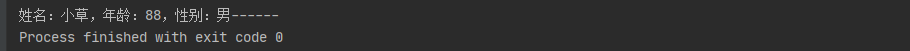

[TOC]

# Python笔记

## 一. 介绍

## 二、基本数据类型

### 1. 字符串（String）

~~~python
str = 'aaa'		# 单引号
str2 = "bbb"	# 双引号
str3 = '''line1
line2
line3'''		# 三引号，表示多行内容
~~~


### 2. 整数（Int）

~~~python
num1 = 1	# Python可以处理任意大小的整数，当然包括负整数，在程序中的表示方法和数学上的写法一模一样
~~~


### 3. 浮点数（Float）

>  浮点数也就是小数 。 整数和浮点数在计算机内部存储的方式是不同的，整数运算永远是精确的，而浮点数运算则可能会有四舍五入的误差 


### 4. 布尔值（Boolean）

>  布尔值和布尔代数的表示完全一致，一个布尔值只有`True`、`False`两种值，要么是`True`，要么是`False`，在Python中，可以直接用`True`、`False`表示布尔值（请注意大小写），也可以通过布尔运算计算出来 ，比如：`3>2`


### 5. 空值（None）

> 空值是Python里一个特殊的值，用`None`表示。`None`不能理解为`0`，因为`0`是有意义的，而`None`是一个特殊的空值。


### 6. 基本数据类型的转换

| 方法                   | 说明                                                  |
| ---------------------- | ----------------------------------------------------- |
| int(x [,base ])        | 将x转换为一个整数                                     |
| float(x )              | 将x转换到一个浮点数                                   |
| complex(real [,imag ]) | 创建一个复数                                          |
| str(x )                | 将对象 x 转换为字符串                                 |
| repr(x )               | 将对象 x 转换为表达式字符串                           |
| eval(str )             | 用来计算在字符串中的有效 Python 表达式,并返回一个对象 |
| tuple(s )              | 将序列 s 转换为一个元组                               |
| list(s )               | 将序列 s 转换为一个列表                               |
| chr(x )                | 将一个整数转换为一个字符                              |
| unichr(x )             | 将一个整数转换为 Unicode 字符                         |
| ord(x )                | 将一个字符转换为它的整数值                            |
| hex(x )                | 将一个整数转换为一个十六进制字符串                    |
| oct(x )                | 将一个整数转换为一个八进制字符串                      |


### 7. 变量

>  变量是用一个变量名表示，可以是任意数据类型，变量名必须是大小写英文、数字和下划线（_）的组合，且不能用数字开头 ，如：`num = 88`


## 三、其他数据类型

### 1. List（列表）

> List 是一种有序的集合，可以随时添加和删除其中的元素 

+ 基本用法

~~~python
# 创建List
list = [11,"nihao",True,99.99]
# 根据下标访问
list[1] = 'hello'
print(list[1])
# 使用append()方法增加集合项
list.append('派生')
print(list)
# 删除元素
del list[3]
print(list)
~~~

+ List（列表）运算符

| Python 表达式                | 结果                         | 描述                 |
| ---------------------------- | ---------------------------- | -------------------- |
| len([1, 2, 3])               | 3                            | 计算元素个数         |
| [1, 2, 3] + [4, 5, 6]        | [1, 2, 3, 4, 5, 6]           | 组合                 |
| ['Hi!'] * 4                  | ['Hi!', 'Hi!', 'Hi!', 'Hi!'] | 复制                 |
| 3 in [1, 2, 3]               | True                         | 元素是否存在于列表中 |
| for x in [1, 2, 3]: print x, | 1 2 3                        | 迭代                 |

+ List （列表）函数&方法

| 函数&方法               | 描述                                                         |
| ----------------------- | ------------------------------------------------------------ |
| len(list)               | 列表元素个数                                                 |
| max(list)               | 返回列表元素最大值                                           |
| min(list)               | 返回列表元素最小值                                           |
| list(seq)               | 将元组转换为列表                                             |
| list.append(obj)        | 在列表末尾添加新的对象                                       |
| list.count(obj)         | 统计某个元素在列表中出现的次数                               |
| list.extend(seq)        | 在列表末尾一次性追加另一个序列中的多个值（用新列表扩展原来的列表） |
| list.index(obj)         | 从列表中找出某个值第一个匹配项的索引位置                     |
| list.insert(index, obj) | 将对象插入列表                                               |
| list.pop(obj=list[-1])  | 移除列表中的一个元素（默认最后一个元素），并且返回该元素的值 |
| list.remove(obj)        | 移除列表中的一个元素（参数是列表中元素），并且不返回任何值   |
| list.reverse()          | 反向列表中元素                                               |
| list.sort([func])       | 对原列表进行排序                                             |


### 2. Tuple（元组）

>  另一种有序列表叫元组：tuple。tuple和list非常类似，但是tuple一旦初始化就不能修改 

+ 基本用法

~~~python
# 创建元组
list = [121, 221]
tuple = (list, 'hello', '你好', False)
# 根据索引获取元素
print(tuple[2])
# 元组无法进行修改，但可以对元组里指定的对象值进行修改，从而影响元组的值
list[0] = 122
list[1] = 222
print(tuple)
# 删除元组：无法删除元素，只能整个元组删除
del tuple
print(tuple)
~~~

+ tuple （元组）运算符

| Python 表达式                | 结果                         | 描述         |
| ---------------------------- | ---------------------------- | ------------ |
| len((1, 2, 3))               | 3                            | 计算元素个数 |
| (1, 2, 3) + (4, 5, 6)        | (1, 2, 3, 4, 5, 6)           | 连接         |
| ('Hi!',) * 4                 | ('Hi!', 'Hi!', 'Hi!', 'Hi!') | 复制         |
| 3 in (1, 2, 3)               | True                         | 元素是否存在 |
| for x in (1, 2, 3): print(x) | 1 2 3                        | 迭代         |

+ 元组内置函数

| 方法       | 描述                 |
| ---------- | -------------------- |
| len(tuple) | 计算元组元素个数     |
| max(tuple) | 返回元组中元素最大值 |
| min(tuple) | 返回元组中元素最小值 |
| tuple(seq) | 将列表转换为元组     |


### 3. dict（字典）

> dict全称dictionary，在其他语言中也称为map，使用键-值（key-value）存储，具有极快的查找速度 

+ 基本用法

~~~python
# dict的创建
dict = {'name': 'Pop', 'age': 17, 'address': '上海'}
# 访问dict
print(dict.get('name'))
print(dict['address'])
# 更新dict
dict['name'] = '小花'     # 修改元素
dict['flag'] = True      # 新增元素
print(dict)
# 删除dict
del dict['flag']    # del关键字删除dist的一个元素
print(dict)
dict.clear()    # 清空dict
print(dict)
del dict        # del关键字删除dict
print(dict)
~~~

+ dict （字典） 的函数和方法

| 方法和函数     | 描述                                             |
| -------------- | ------------------------------------------------ |
| len(dict)      | 计算字典元素个数                                 |
| str(dict)      | 输出字典可打印的字符串表示                       |
| type(variable) | 返回输入的变量类型，如果变量是字典就返回字典类型 |
| dict.clear()   | 删除字典内所有元素                               |
| dict.copy()    | 返回一个字典的浅复制                             |
| dict.values()  | 以列表返回字典中的所有值                         |
| popitem()      | 随机返回并删除字典中的一对键和值                 |
| dict.items()   | 以列表返回可遍历的(键, 值) 元组数组              |

+ dict（字典）使用时注意的事项

> 1.  dict （字典）是不允许一个键创建两次的，但是在创建 dict （字典）的时候如果出现了一个键值赋予了两次，会以最后一次赋予的值为准 
> 2.  dict （字典）键必须不可变，可是键可以用数字，字符串或元组充当，但是就是不能使用列表 
> 3.   dict 内部存放的顺序和 key 放入的顺序是没有任何关系 
>
> **和 list 比较，dict 有以下几个特点：**
>
> - 查找和插入的速度极快，不会随着key的增加而变慢
> - 需要占用大量的内存，内存浪费多
>
> **而list相反：**
>
> - 查找和插入的时间随着元素的增加而增加
> - 占用空间小，浪费内存很少


### 4. set

>   set和其他语言类似, 是一个无序不重复元素集 

~~~python
# 创建Set
set  = set([1,2,3,4,4])
print(set)
# 添加元素
set.add('add')
print(set)
# 删除元素
set.remove(4)
print(set)
~~~


## 四、条件语句和循环语句

### 1. 条件语句

>  非零数值、非空字符串、非空 list 等，判断为 True，否则为 False 

~~~python
# if语句
score = 90
if 60 < score < 80:
    print('及格')
elif score > 80:
    print('优秀')
else:
    print('不及格')
~~~


### 2. 循环语句

+ 循环控制语句

| 循环控制语句 | 描述                                                         |
| ------------ | ------------------------------------------------------------ |
| break        | 在语句块执行过程中终止循环，并且跳出整个循环                 |
| continue     | 在语句块执行过程中终止当前循环，跳出该次循环，执行下一次循环 |
| pass         | pass 是空语句，是为了保持程序结构的完整性                    |

+ **for循环**

~~~python
# for 循环
arr = [121, 333, 555, 765]
for item in arr:
    print(item)
# 配合range()函数使用
for item in range(4):   # range(x,y)生成一个从x到y的整数序列，range(4)相当等于range(0,4)
    print(item)
~~~

+ **while循环**

~~~python
# while 循环
count = 0
while count<5:
    print(count)
    count = count +1
~~~

> for 和 while 循环的区别：
>
> - for 循环主要用在迭代可迭代对象的情况。
> - while 循环主要用在需要满足一定条件为真，反复执行的情况。 （死循环+break 退出等情况。）
> - 部分情况下，for 循环和 while 循环可以互换使用（嵌套循环）。


## 五、函数

### 1. 定义函数

```python
def 函数名(参数1，参数2....参数n):
    函数体
    return 语句
```

> 函数定义步骤：
>
> - 函数代码块以 def 关键词开头，后接函数标识符名称和圆括号()
> - 任何传入参数和自变量必须放在圆括号中间。圆括号之间可以用于定义参数
> - 函数的第一行语句可以选择性地使用文档字符串（用于存放函数说明）
> - 函数内容以冒号起始，并且缩进
> - return [表达式] 结束函数，选择性地返回一个值给调用方。不带表达式的 return 相当于返回 None。

**示例：**

~~~python
# 定义函数
def sum(num1, num2):
    return num1 + num2
# 调用函数
print(sum(4,6))
~~~


### 2. 函数的返回值

+ **函数没有返回值（`return`）的情况下，默认返回`None`**

~~~python
def sum(num1, num2):
    print(num1 + num2)
# 没有返回值（return）=>返回None
print(sum(1, 2))
# 不传参数=>报错TypeError
print(sum())
~~~

**执行结果：**


+ **函数返回多个值**

~~~python
def sum_sub(num1, num2):
    ret1 = num1 + num2
    ret2 = num1 - num2
    return ret1, ret2
print(sum_sub(67, 18))
# 返回多个值时会自动将所有值转化为一个元组
print(isinstance(sum_sub(67, 18), tuple))
~~~

**执行结果：**


### 3. 函数的参数

>  主要的参数类型有：默认参数、关键字参数（位置参数）、不定长参数。 

+ **默认参数**

~~~python
def print_user_info(name, age, gender='男'):
    print('姓名：{0}，年龄：{1}，性别：{2}'.format(name, age, gender), end='------')
# 调用打印用户信息函数
print_user_info('花花', 12)
~~~

**执行结果：**


> 1.  **只有在形参表末尾的那些参数可以有默认参数值，比如：def func(a=1, b) 是无效的** 
> 2.  **默认参数的值是不可变的对象，比如None、True、False、数字或字符串，不能为list等可变对象** 

~~~python
# 函数参数为list
def print_info(a, b=[]):
    print(b)
    return b;
result = print_info(1)
result.append('error')
print_info(2)		# 从外部改变b参数的值之后再次调用函数会发现之前添加的值还在list内
~~~

**执行结果：**


+ **关键字参数（位置参数） **

>   Python 中，可以通过参数名来给函数传递参数，而不用关心参数列表定义时的顺序，这被称之为关键字参数 
>
> 使用关键参数有两个优势 ：
>
> - 由于我们不必担心参数的顺序，使用函数变得更加简单了。
> - 假设其他参数都有默认值，我们可以只给我们想要的那些参数赋值

~~~python
# 关键参数
def print_user_info(name, age, gender='男'):
    print('姓名：{0}，年龄：{1}，性别：{2}'.format(name, age, gender), end='------')
print_user_info(age=88, name='小草')
~~~

**执行结果：**



+ **不定长参数**

>  Python 提供了一种元组的方式来接受没有直接定义的参数。这种方式在参数前边加星号 `*` 

~~~python
# 不定长参数
def print_user_info(name, age, gender='男', *hobby):
    print('姓名：{0}，年龄：{1}，性别：{2}'.format(name, age, gender), end='------')
    print('兴趣：{}'.format(hobby))
print_user_info('小明', 12, '女', '象棋', '画画', '种草')
~~~

**执行结果：**


> 上面的方式由于无法使用**关键字参数**去定位`*hobby`所以默认值参数也会失效，想要`hobby`支持关键字参数需要使用`**`的前缀，比如：

~~~python
def print_user_info(name, age, gender='男', **hobby):
    print('姓名：{0}，年龄：{1}，性别：{2}'.format(name, age, gender), end='------')
    print('兴趣：{}'.format(hobby))
# hobby使用tuple（元组）的类型去传参
print_user_info('小明', 12, hobby=('象棋', '画画', '种草'))
~~~

**执行结果：**


> 由打印的格式可以看出， `*hobby`是可变参数，且 hobby其实就是一个 tuple （元祖），`**hobby`是关键字参数，且 hobby 就是一个 dict （字典） 

+ **只接受关键字参数**

>  将参数放到某个`*`参数或者单个`*`后面就能强制让参数使用关键字方法赋值

~~~python
# 只接受关键字参数
def print_user_info(name, *, age, gender='男'):
    print('姓名：{0}，年龄：{1}，性别：{2}'.format(name, age, gender), end='------')
# age,gender必须使用关键字参数的方式赋值，否则将会报错
print_user_info('小凯', age=11)
~~~

**执行结果：**


### 4. 函数传值问题

> 感觉没啥好记的，这里留个[链接](https://github.com/TwoWater/Python/blob/master/Article/PythonBasis/python6/4.md)，后续实际遇到这种问题再说


### 5. 匿名函数

> python 使用 lambda 来创建匿名函数，也就是不再使用 def 语句这样标准的形式定义一个函数。 
>
>匿名函数主要有以下特点：
>
>- lambda 只是一个表达式，函数体比 def 简单很多。
>- lambda 的主体是一个表达式，而不是一个代码块。仅仅能在 lambda 表达式中封装有限的逻辑进去。
>- lambda 函数拥有自己的命名空间，且不能访问自有参数列表之外或全局命名空间里的参数。
>
>**基本语法：**
>
>```python
>lambda [arg1 [,arg2,.....argn]]:expression
>```

~~~python
# 匿名函数
sum = lambda num1, num2: num1 + num2
print(sum(1, 4))
~~~

>  注意：**尽管 lambda 表达式允许你定义简单函数，但是它的使用是有限制的。 你只能指定单个表达式，它的值就是最后的返回值。也就是说不能包含其他的语言特性了， 包括多个语句、条件表达式、迭代以及异常处理等等。** 

**特殊情况：**

~~~python
num2 = 100
sum1 = lambda num1: num1 + num2;

num2 = 10000
sum2 = lambda num1: num1 + num2;

print(sum1(1))
print(sum2(1))
~~~

**运行结果：**


> **这主要在于 lambda 表达式中的 num2 是一个自由变量，在运行时绑定值，而不是定义时就绑定，这跟函数的默认值参数定义是不同的。所以建议还是遇到这种情况还是使用第一种解法。**


## 六、迭代器和生成器