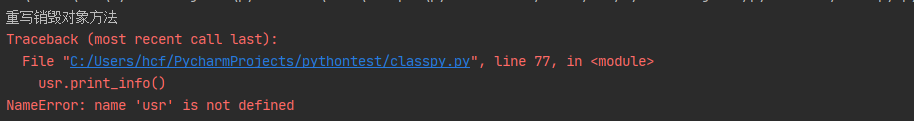
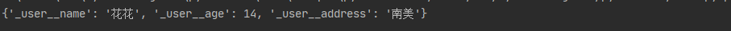
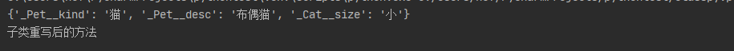

## 七、面向对象

### 1. 面向对象概念

+ **两个基本概念**

> 1. **类：**用来描述具有相同的属性和方法的对象的集合。它定义了该集合中每个对象所共有的属性和方法。
>
> 1. **对象：**通过类定义的数据结构实例

+ **三大特性**

> 1. **继承：**即一个派生类（derived class）继承基类（base class）的字段和方法。继承也允许把一个派生类的对象作为一个基类对象对待。
> 2. **多态：**它是指对不同类型的变量进行相同的操作，它会根据对象（或类）类型的不同而表现出不同的行为。
> 3. **封装：**就是将抽象得到的数据和行为（或功能）相结合，形成一个有机的整体（即类）；封装的目的是增强安全性和简化编程，使用者不必了解具体的实现细节，而只是要通过外部接口，一特定的访问权限来使用类的成员


### 2. 类的定义和调用

定义一个类语法：

~~~python
class ClassName():
    <statement-1>
    .
    .
    .
    <statement-N>
~~~

声明一个对象：

~~~python
class user():
    name = '刘禹锡'
    age = 19
    address = '张家口'
    
    def func():
        print('我就是一个简单的方法')
~~~

调用类中的属性方法：

> 调用属性：类名.属性名
>
> 调用方法：类名.函数名()

~~~python
user.name = '张予曦'	# 调用属性
user.func()			# 调用方法
~~~


### 3.  类方法

类内方法调用属性：

~~~python
class user():
    name = '刘禹锡'
    age = 19
    address = '张家口'

    def print_info(self):
        print('姓名：{0}，年龄：{1}，住址：{2}'
              .format(self.name, self.age, self.address), end='    ')

    @classmethod
    def print_info_cls(cls, date):
        print('姓名：{0}，年龄：{1}，住址：{2}------打印时间：{3}'
              .format(cls.name, cls.age, cls.address, date), end='    ')
# 修改属性并调用函数的打印方法
user.name = '张克吉'
# cls参数不需要传入，只需要将后面的参数传入类函数内就可以了
user.print_info_cls(datetime.datetime.now())
print()
#没加类函数修饰器的函数需要将user类作为参数传到函数中
user.print_info(user)
~~~

> `@classmethod`是python内置的函数装饰器，主要作用是将类中的函数方法转化为类方法。被`@classmethod`修饰的类需要传入一个默认参数`cls`，可用此参数调用类内的属性，并且在调用该方法时`cls`参数不需要传入


### 4. 类和对象

> 类和对象的关系：类是对象的模板。从模板到对象的过程，称为实例化。

~~~python
class user():
    name = '刘禹锡'
    age = 19
    address = '张家口'

    def print_info(self):
        print('姓名：{0}，年龄：{1}，住址：{2}'.format(self.name, self.age, self.address))

    @classmethod
    def print_info_cls(cls, date):
        print('姓名：{0}，年龄：{1}，住址：{2}------打印时间：{3}'
              .format(cls.name, cls.age, cls.address, date))
# 实例化user的对象u1
u1 = user()
u1.name = '实例化后的名字'
# 通过对象调用@classmethod修饰的方法，对象u1修改的属性没有奏效
u1.print_info_cls(datetime.datetime.now())
# 直接修改类属性后再调用@classmethod修饰的方法
user.name = '直接修改名字'
user.print_info_cls(datetime.datetime.now())
# 直接修改类属性不影响类实例化后的对象的值
u1.print_info()
~~~

执行效果：


> 通过实例化对象后调用的方法不需要用`@classmethod`修改，而是从`cls`参数变为了`self`，参数`self`的名称可以随意改变，但必须位于方法参数的首尾，是默认的特殊参数

重写类方法：

~~~python
# 先声明一个函数
def after_edit_print():
    print('你的方法被我修改了')
# 此处不加括号应该可以用js的理解：
# 加()是调用函数，不加()是函数对象，此处重写的是函数对象，调用时函数的内容就变了
u1.print_info = after_edit_print
u1.print_info()
~~~


### 5. 初始化函数

> 即构造函数，在python中为`__init__()`，`__init__()`的第一个参数永远是`self`，用于绑定属性

~~~python
# 还是用这个类
class user():
    name = '刘禹锡'
    age = 19
    address = '张家口'
	# 初始化方法是class内置的函数，调用时需要注意方法名
    def __init__(self, name, age):
        self.name = name
        self.age = age
	# 自定义打印函数
    def print_info(self):
        print('姓名：{0}，年龄：{1}，住址：{2}'.format(self.name, self.age, self.address))
# 实例化对象
usr = user('init', 1)
usr.print_info()
~~~

执行效果：


销毁对象方法（析构函数）：

~~~python
class user():
    name = '刘禹锡'
    age = 19
    address = '张家口'

    def __init__(self, name, age):
        self.name = name
        self.age = age
	# 重写销毁方法（不重写）
    def __del__(self):
        print('重写销毁对象方法')

    def print_info(self):
        print('姓名：{0}，年龄：{1}，住址：{2}'.format(self.name, self.age, self.address))

usr = user('init', 1)
# 销毁对象后再调用函数
del usr
usr.print_info()
~~~

执行效果：




### 6. 类的访问限制

>  如果要让内部属性不被外部访问，可以把属性的名称前加上两个下划线`__`，在Python中，实例的变量名如果以`__`开头，就变成了一个私有变量（private），只有内部可以访问，外部不能访问 。需要外部访问私有属性可设置`get/set`方法（和java类似）
>
>  需要注意的是，在Python中，变量名类似`__xxx__`的，也就是以双下划线开头，并且以双下划线结尾的，是特殊变量，特殊变量是可以直接访问的，不是private变量，所以，不能用`__name__`、`__score__`这样的变量名。 

类的属性访问限制：

~~~python
class user:
    # 构造方法内赋值
    def __init__(self, name, age, address):
        self.__name = name
        self.__age = age
        self.__address = address
	# 将对象转属性化为dict输出
    def print_user(self):
        print(self.__dict__)
# 实例化对象
usr = user('花花', 14, '南美')
usr.print_user()
~~~

执行效果：



>由输出内容看出，原本的`--name`属性被转化为`_user__name`了，虽然使用`usr.__name`无法调用对象的属性，但是使用`usr._user__name`还是可以强制调用的。所以`__`双下划线的属性并不是真正的私有属性，Python对属性的控制还是要看程序员自己

类的方法访问限制：

~~~python
class user:
    def __init__(self, name, age, address):
        self.__name = name
        self.__age = age
        self.__address = address
	# 方法名采用单下划线开头就可以将方法设置为私有方法
    def __print_user(self):
        print(self.__dict__)
# 通过对象尝试调用私有方法
usr = user('花花', 14, '南美')
usr.__print_user()
~~~

执行效果：


>  方法的访问控制也是跟属性是一样的，也是没有实质上的私有方法 。转化后方法名：`_user__print_user`

**类的专有方法：**

| 方法          | 说明                       |
| ------------- | -------------------------- |
| `__init__`    | 构造函数，在生成对象时调用 |
| `__del__`     | 析构函数，释放对象时使用   |
| `__repr__`    | 打印，转换                 |
| `__setitem__` | 按照索引赋值               |
| `__getitem__` | 按照索引获取值             |
| `__len__`     | 获得长度                   |
| `__cmp__`     | 比较运算                   |
| `__call__`    | 函数调用                   |
| `__add__`     | 加运算                     |
| `__sub__`     | 减运算                     |
| `__mul__`     | 乘运算                     |
| `__div__`     | 除运算                     |
| `__mod__`     | 求余运算                   |
| `__pow__`     | 乘方                       |

> 获取类信息的相关方法：
>
> - `type(obj)`：来获取对象的相应类型；
> - `isinstance(obj, type)`：判断对象是否为指定的 type 类型的实例；
> - `hasattr(obj, attr)`：判断对象是否具有指定属性/方法；
> - `getattr(obj, attr[, default])` 获取属性/方法的值, 要是没有对应的属性则返回 default 值（前提是设置了 default），否则会抛出 AttributeError 异常；
> - `setattr(obj, attr, value)`：设定该属性/方法的值，类似于 obj.attr=value；
> - `dir(obj)`：可以获取相应对象的所有属性和方法名的列表：


### 7. 类的继承

继承的基本语法：

~~~python
class ClassName(BaseClassName...):
    <statement-1>
    .
    .
    .
    <statement-N>
~~~

> 继承的子类的好处：
>
> - 会继承父类的属性和方法
> - 可以自己定义，覆盖父类的属性和方法

调用父类方法：

~~~python
# 父类
class Pet:
    def __init__(self, kind, desc, size):
        self.__kind = kind
        self.__desc = desc
        self.__size = size
    def print_info(self):
        print(self.__dict__)
    def simple_print(self):
        print(self.__kind+'父类的打印方法')
# 子类
class Cat(Pet):
    # 重写父类的方法
    def simple_print(self):
        print('子类重写后的方法')
# 实例化并调用
new_cat = Cat('猫', '布偶猫', '小')
new_cat.print_info()
new_cat.simple_print()
~~~

执行效果：



**子类的类型判断：**

~~~python
class User1(object):
    pass

class User2(User1):
    pass

class User3(User2):
    pass

if __name__ == '__main__':
    user1 = User1()
    user2 = User2()
    user3 = User3()
    # 使用isinstance()来判断对象是否属于某个类
    print(isinstance(user3, User2))
    print(isinstance(user3, User1))
    print(isinstance(user3, User3))
    # 判断基本类型
    print(isinstance('两点水', str))
    print(isinstance(347073565, int))
    print(isinstance(347073565, str))
~~~

>  `isinstance()` 可以判断一个对象是否是某种类型，也可以用于基本类型的判断。 


### 8. 类的多态

> 多态指对不同类型的变量进行相同的操作，它会根据对象（或类）类型的不同而表现出不同的行为

例子直接复制了，随便看看：

~~~python
class User(object):
    def __init__(self, name):
        self.name = name
    def printUser(self):
        print('Hello !' + self.name)

class UserVip(User):
    def printUser(self):
        print('Hello ! 尊敬的Vip用户：' + self.name)

class UserGeneral(User):
    def printUser(self):
        print('Hello ! 尊敬的用户：' + self.name)

def printUserInfo(user):
    user.printUser()

if __name__ == '__main__':
    userVip = UserVip('两点水')
    printUserInfo(userVip)
    userGeneral = UserGeneral('水水水')
    printUserInfo(userGeneral)
~~~

输出的结果:

```python
Hello ! 尊敬的Vip用户：两点水
Hello ! 尊敬的用户：水水水
```

> 有了继承，才有了多态，也会有不同类的对象对同一消息会作出不同的相应。****