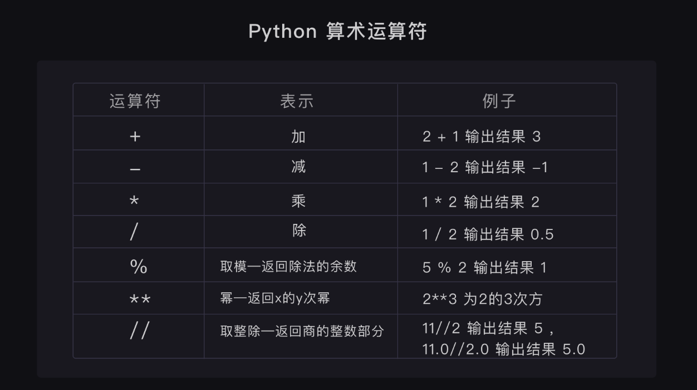

>  ## 二、基本数据类型
>
>  ### 1. 字符串-String
>
>  ~~~python
>  str = 'aaa'		# 单引号
>  str2 = "bbb"	# 双引号
>  str3 = '''line1
>  line2
>  line3'''		# 三引号，表示多行内容
>  ~~~
>
>  格式化字符串（语法糖）：
>
>  ~~~python
>  a = 'hello'
>  b = f'{a} world'
>  print(b)
>  ~~~
>
>  
>
>  ### 2. 整数-Int
>
>  ~~~python
>  num1 = 1	# Python可以处理任意大小的整数，当然包括负整数，在程序中的表示方法和数学上的写法一模一样
>  ~~~
>
>  
>
>  
>
>  ### 3. 浮点数-Float
>
>  >  浮点数也就是小数 。 整数和浮点数在计算机内部存储的方式是不同的，整数运算永远是精确的，而浮点数运算则可能会有四舍五入的误差 
>
>  
>
>  ### 4. 布尔值-Boolean
>
>  >  布尔值和布尔代数的表示完全一致，一个布尔值只有`True`、`False`两种值，要么是`True`，要么是`False`，在Python中，可以直接用`True`、`False`表示布尔值（请注意大小写），也可以通过布尔运算计算出来 ，比如：`3>2`
>
>  
>
>  ### 5. 空值-None
>
>  > 空值是Python里一个特殊的值，用`None`表示。`None`不能理解为`0`，因为`0`是有意义的，而`None`是一个特殊的空值。
>
>  
>
>  ### 6. 基本数据类型的转换
>
>  | 方法                   | 说明                                                  |
>  | ---------------------- | ----------------------------------------------------- |
>  | int(x [,base ])        | 将x转换为一个整数                                     |
>  | float(x )              | 将x转换到一个浮点数                                   |
>  | complex(real [,imag ]) | 创建一个复数                                          |
>  | str(x )                | 将对象 x 转换为字符串                                 |
>  | repr(x )               | 将对象 x 转换为表达式字符串                           |
>  | eval(str )             | 用来计算在字符串中的有效 Python 表达式,并返回一个对象 |
>  | tuple(s )              | 将序列 s 转换为一个元组                               |
>  | list(s )               | 将序列 s 转换为一个列表                               |
>  | chr(x )                | 将一个整数转换为一个字符                              |
>  | unichr(x )             | 将一个整数转换为 Unicode 字符                         |
>  | ord(x )                | 将一个字符转换为它的整数值                            |
>  | hex(x )                | 将一个整数转换为一个十六进制字符串                    |
>  | oct(x )                | 将一个整数转换为一个八进制字符串                      |
>
>  
>
>  ### 7. 变量
>
>  >  变量是用一个变量名表示，可以是任意数据类型，变量名必须是大小写英文、数字和下划线（_）的组合，且不能用数字开头 ，如：`num = 88`