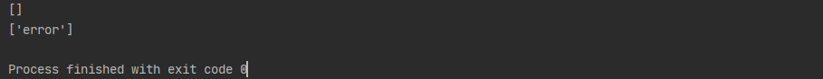
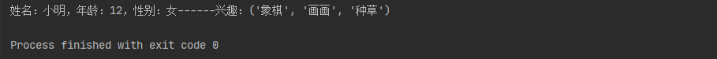
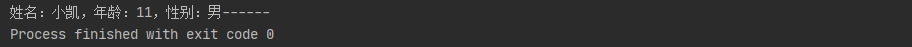

## 五、函数

### 1. 定义函数

```python
def 函数名(参数1，参数2....参数n):
    函数体
    return 语句
```

> 函数定义步骤：
>
> - 函数代码块以 def 关键词开头，后接函数标识符名称和圆括号()
> - 任何传入参数和自变量必须放在圆括号中间。圆括号之间可以用于定义参数
> - 函数的第一行语句可以选择性地使用文档字符串（用于存放函数说明）
> - 函数内容以冒号起始，并且缩进
> - return [表达式] 结束函数，选择性地返回一个值给调用方。不带表达式的 return 相当于返回 None。

**示例：**

~~~python
# 定义函数
def sum(num1, num2):
    return num1 + num2
# 调用函数
print(sum(4,6))
~~~


### 2. 函数的返回值

+ **函数没有返回值（`return`）的情况下，默认返回`None`**

~~~python
def sum(num1, num2):
    print(num1 + num2)
# 没有返回值（return）=>返回None
print(sum(1, 2))
# 不传参数=>报错TypeError
print(sum())
~~~

**执行结果：**


+ **函数返回多个值**

~~~python
def sum_sub(num1, num2):
    ret1 = num1 + num2
    ret2 = num1 - num2
    return ret1, ret2
print(sum_sub(67, 18))
# 返回多个值时会自动将所有值转化为一个元组
print(isinstance(sum_sub(67, 18), tuple))
~~~

**执行结果：**


### 3. 函数的参数

>  主要的参数类型有：默认参数、关键字参数（位置参数）、不定长参数。 

+ **默认参数**

~~~python
def print_user_info(name, age, gender='男'):
    print('姓名：{0}，年龄：{1}，性别：{2}'.format(name, age, gender), end='------')
# 调用打印用户信息函数
print_user_info('花花', 12)
~~~

**执行结果：**


> 1.  **只有在形参表末尾的那些参数可以有默认参数值，比如：def func(a=1, b) 是无效的** 
> 2.  **默认参数的值是不可变的对象，比如None、True、False、数字或字符串，不能为list等可变对象** 

~~~python
# 函数参数为list
def print_info(a, b=[]):
    print(b)
    return b;
result = print_info(1)
result.append('error')
print_info(2)		# 从外部改变b参数的值之后再次调用函数会发现之前添加的值还在list内
~~~

**执行结果：**



+ **关键字参数（位置参数） **

>   Python 中，可以通过参数名来给函数传递参数，而不用关心参数列表定义时的顺序，这被称之为关键字参数 
>
>   使用关键参数有两个优势 ：
>
>   - 由于我们不必担心参数的顺序，使用函数变得更加简单了。
>   - 假设其他参数都有默认值，我们可以只给我们想要的那些参数赋值

~~~python
# 关键参数
def print_user_info(name, age, gender='男'):
    print('姓名：{0}，年龄：{1}，性别：{2}'.format(name, age, gender), end='------')
print_user_info(age=88, name='小草')
~~~

**执行结果：**


+ **不定长参数**

>  Python 提供了一种元组的方式来接受没有直接定义的参数。这种方式在参数前边加星号 `*` 

~~~python
# 不定长参数
def print_user_info(name, age, gender='男', *hobby):
    print('姓名：{0}，年龄：{1}，性别：{2}'.format(name, age, gender), end='------')
    print('兴趣：{}'.format(hobby))
print_user_info('小明', 12, '女', '象棋', '画画', '种草')
~~~

**执行结果：**



> 上面的方式由于无法使用**关键字参数**去定位`*hobby`所以默认值参数也会失效，想要`hobby`支持关键字参数需要使用`**`的前缀，比如：

~~~python
def print_user_info(name, age, gender='男', **hobby):
    print('姓名：{0}，年龄：{1}，性别：{2}'.format(name, age, gender), end='------')
    print('兴趣：{}'.format(hobby))
# hobby使用tuple（元组）的类型去传参
print_user_info('小明', 12, hobby=('象棋', '画画', '种草'))
~~~

**执行结果：**


> 由打印的格式可以看出， `*hobby`是可变参数，且 hobby其实就是一个 tuple （元祖），`**hobby`是关键字参数，且 hobby 就是一个 dict （字典） 

+ **只接受关键字参数**

>  将参数放到某个`*`参数或者单个`*`后面就能强制让参数使用关键字方法赋值

~~~python
# 只接受关键字参数
def print_user_info(name, *, age, gender='男'):
    print('姓名：{0}，年龄：{1}，性别：{2}'.format(name, age, gender), end='------')
# age,gender必须使用关键字参数的方式赋值，否则将会报错
print_user_info('小凯', age=11)
~~~

**执行结果：**




### 4. 函数传值问题

> 感觉没啥好记的，这里留个[链接](https://github.com/TwoWater/Python/blob/master/Article/PythonBasis/python6/4.md)，后续实际遇到这种问题再说


### 5. 匿名函数

> python 使用 lambda 来创建匿名函数（lambda函数表达式），也就是不再使用 def 语句这样标准的形式定义一个函数。 
>
> 匿名函数主要有以下特点：
>
> - lambda 只是一个表达式，函数体比 def 简单很多。
> - lambda 的主体是一个表达式，而不是一个代码块。仅仅能在 lambda 表达式中封装有限的逻辑进去。
> - lambda 函数拥有自己的命名空间，且不能访问自有参数列表之外或全局命名空间里的参数。
>
> **基本语法：**
>
> ```python
> lambda 参数列表:返回值
> ```

~~~python
# 匿名函数
sum = lambda num1, num2: num1 + num2
# 一般不用把lambda函数赋给一个变量的方式调用
print(sum(1, 4))
# 直接加括号调用(一般不这么用)
print(( lambda num1, num2: num1 + num2)(12,4))
# 使用filter(function,arr)函数举例
arr = filter(lambda i: i % 2 == 0, [1, 4, 6, 7, 9, 10])
print(list(arr))
# 使用map(function,arr)函数举例
l = [1, 2, 3, 4, 5, 6, 7, 8, 9]
r = map(lambda i: i + 1, l)
print(list(r))
~~~

>  注意：**尽管 lambda 表达式允许你定义简单函数，但是它的使用是有限制的。 你只能指定单个表达式，它的值就是最后的返回值。也就是说不能包含其他的语言特性了， 包括多个语句、条件表达式、迭代以及异常处理等等。** 

**特殊情况：**

~~~python
num2 = 100
sum1 = lambda num1: num1 + num2;

num2 = 10000
sum2 = lambda num1: num1 + num2;

print(sum1(1))
print(sum2(1))
~~~

**运行结果：**


> **这主要在于 lambda 表达式中的 num2 是一个自由变量，在运行时绑定值，而不是定义时就绑定，这跟函数的默认值参数定义是不同的。所以建议还是遇到这种情况还是使用第一种解法。**


### 6. 作用域（scope）

+ **全局作用域**

> 1. 全局作用域在程序（.py文件）执行时创建，在程序结束时销毁
> 2. 在函数以外的区域都是全局作用域
> 3. 在全局作用域中定义的变量，都属于全局变量，全局变量可以在程序的任意位置被访问

+ **函数作用域**

> 1. 函数作用域在函数调用时创建，调用结束时销毁
> 2. 函数每调用一次就会产生一个新的函数作用域
> 3. 在函数作用域中定义的变量，都是局部变量，只能在函数内部被访问

+ **变量的查找**

> 1. 当使用变量时，会优先在当前作用域寻找该变量，如果有则使用，没有则继续去上一级作用域寻找
> 2. 在函数中为变量赋值时，默认都是局部变量。如果需要在函数内部修改全局变量，则需要使用`global`关键字来声明变量

~~~python
# 在函数内部修改全局变量
a = 20
def func():
    global a	# 先声明a是全局变量
    a = 10		# 再给a赋值
    print('函数内部，a =', a)
func()
print('函数外部，a =', a)
~~~

执行效果：

~~~python
函数内部，a = 10
函数外部，a = 10
~~~

获取当前命名空间和全局命名空间：

~~~python
# 获取当前的命名空间，返回一个dict
locals()
# 获取全局命名空间
global()
~~~


### 7.  装饰器

~~~python
def begin_end(func):
    def new_func(*args, **kwargs):
        print('开始执行函数')
        func(*args, **kwargs)
        print('执行函数结束')

    return new_func


@begin_end
def print_hello(text):
    print('hello~~~~~~~~~~~' + text)


print_hello('芜湖')
~~~

>装饰器作用：
>
>1. 通过装饰器，可以在不修改原来函数的情况下对函数进行扩展，通常用于开发中对功能的扩展。
>2. 可以为同一个函数指定多个装饰器，此时函数将会按照从内向外的顺序被装饰。
>3. 遵守开闭原则。
>
>`*args, **kwargs`表示接受所有的位置参数和关键字参数

