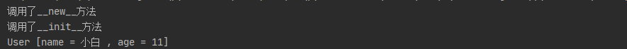

## 八、特殊方法

> 在 Python 中，所有以 "__" 双下划线包起来的方法，都统称为特殊方法，或者魔术方法（Magic Method），特殊方法一般不需要我们手动调用，会在特殊情况下自动执行。[官方文档](https://docs.python.org/zh-cn/3/reference/datamodel.html#special-method-names)

### 1. [构造和初始化](https://github.com/SalamanPhoo/Python/blob/master/Article/PythonBasis/python10/2.md)

> 构造`__new__`：在类被实例化时调用，有返回值
>
> 初始化`__init__`：初始化方法，只能返回`None`值

~~~python
class User:
    def __new__(cls, *args, **kwargs):
        print('调用了__new__方法')
        return super(User, cls).__new__(cls)

    def __init__(self, name, age):
        print('调用了__init__方法')
        self.__name = name
        self.__age = age
	
    # 此方法在尝试将对象转化为字符串的时候调用，可以指定对象转换字符串的结果
    def __str__(self):
        return 'User [name = %s , age = %d]' % (self.__name, self.__age)

user = User('小白', 11)
print(user)
~~~

执行结果：

### 2. [属性的访问控制魔术方法](https://github.com/SalamanPhoo/Python/blob/master/Article/PythonBasis/python10/3.md)

| 方法                             | 说明                                                         |
| -------------------------------- | ------------------------------------------------------------ |
| `__getattr__(self, name)`        | 该方法定义了你试图访问一个不存在的属性时的行为。因此，重载该方法可以实现捕获错误拼写然后进行重定向, 或者对一些废弃的属性进行警告。 |
| `__setattr__(self, name, value)` | 定义了对属性进行赋值和修改操作时的行为。不管对象的某个属性是否存在,都允许为该属性进行赋值.有一点需要注意，实现 `__setattr__` 时要避免"无限递归"的错误， |
| `__delattr__(self, name)`        | `__delattr__` 与 `__setattr__` 很像，只是它定义的是你删除属性时的行为。实现 `__delattr__` 是同时要避免"无限递归"的错误 |
| `__getattribute__(self, name)`   | `__getattribute__` 定义了你的属性被访问时的行为，相比较，`__getattr__` 只有该属性不存在时才会起作用。因此，在支持 `__getattribute__ `的 Python 版本,调用`__getattr__` 前必定会调用 `__getattribute__``__getattribute__` 同样要避免"无限递归"的错误。 |

示例：

~~~python
class User(object):
    def __getattr__(self, name):
        print('调用了 __getattr__ 方法')
        return super(User, self).__getattr__(name)

    def __setattr__(self, name, value):
        print('调用了 __setattr__ 方法')
        return super(User, self).__setattr__(name, value)

    def __delattr__(self, name):
        print('调用了 __delattr__ 方法')
        return super(User, self).__delattr__(name)

    def __getattribute__(self, name):
        print('调用了 __getattribute__ 方法')
        return super(User, self).__getattribute__(name)

if __name__ == '__main__':
    user = User()
    # 设置属性值，会调用 __setattr__
    user.attr1 = True
    # 属性存在,只有__getattribute__调用
    user.attr1
    try:
        # 属性不存在, 先调用__getattribute__, 后调用__getattr__
        user.attr2
    except AttributeError:
        pass
    # __delattr__调用
    del user.attr1
~~~

执行结果：

~~~python
调用了 __setattr__ 方法
调用了 __getattribute__ 方法
调用了 __getattribute__ 方法
调用了 __getattr__ 方法
调用了 __delattr__ 方法
~~~

### 3. [对象的描述器](https://github.com/SalamanPhoo/Python/blob/master/Article/PythonBasis/python10/4.md)

~~~python
class User(object):
    def __init__(self, name='两点水', sex='男'):
        self.sex = sex
        self.name = name

    def __get__(self, obj, objtype):
        print('获取 name 值')
        return self.name

    def __set__(self, obj, val):
        print('设置 name 值')
        self.name = val

class MyClass(object):
    x = User('两点水', '男')
    y = 5

if __name__ == '__main__':
    m = MyClass()
    m.x = '花花'
    print(m.x)
    print(m.y)
~~~

输出：

~~~python
设置 name 值
获取 name 值
花花
5
~~~

### 4. [自定义容器（Container）](https://github.com/SalamanPhoo/Python/blob/master/Article/PythonBasis/python10/5.md)

> Python 中，常见的容器类型有: dict, tuple, list, string。其中也提到过可容器和不可变容器的概念。其中 tuple, string 是不可变容器，dict, list 是可变容器。

| 功能                                                         | 说明                                                         |
| ------------------------------------------------------------ | ------------------------------------------------------------ |
| 自定义不可变容器类型                                         | 需要定义 `__len__` 和 `__getitem__` 方法                     |
| 自定义可变类型容器                                           | 在不可变容器类型的基础上增加定义 `__setitem__` 和 `__delitem__` |
| 自定义的数据类型需要迭代                                     | 需定义 `__iter__`                                            |
| 返回自定义容器的长度                                         | 需实现 `__len__(self)`                                       |
| 自定义容器可以调用 `self[key]` ，如果 key 类型错误，抛出TypeError ，如果没法返回key对应的数值时,该方法应该抛出ValueError | 需要实现 `__getitem__(self, key)`                            |
| 当执行 `self[key] = value` 时                                | 调用是 `__setitem__(self, key, value)`这个方法               |
| 当执行 `del self[key]` 方法                                  | 其实调用的方法是 `__delitem__(self, key)`                    |
| 当你想你的容器可以执行 `for x in container:` 或者使用 `iter(container)` 时 | 需要实现 `__iter__(self)` ，该方法返回的是一个迭代器         |

~~~python
class FunctionalList:
    ''' 实现了内置类型list的功能,并丰富了一些其他方法: head, tail, init, last, drop, take'''

    def __init__(self, values=None):
        if values is None:
            self.values = []
        else:
            self.values = values

    def __len__(self):
        return len(self.values)

    def __getitem__(self, key):
        return self.values[key]

    def __setitem__(self, key, value):
        self.values[key] = value

    def __delitem__(self, key):
        del self.values[key]

    def __iter__(self):
        return iter(self.values)

    def __reversed__(self):
        return FunctionalList(reversed(self.values))

    def append(self, value):
        self.values.append(value)

    def head(self):
        # 获取第一个元素
        return self.values[0]

    def tail(self):
        # 获取第一个元素之后的所有元素
        return self.values[1:]

    def init(self):
        # 获取最后一个元素之前的所有元素
        return self.values[:-1]

    def last(self):
        # 获取最后一个元素
        return self.values[-1]

    def drop(self, n):
        # 获取所有元素，除了前N个
        return self.values[n:]

    def take(self, n):
        # 获取前N个元素
        return self.values[:n]
~~~

### 5. [运算符相关的魔术方法](https://github.com/SalamanPhoo/Python/blob/master/Article/PythonBasis/python10/6.md)

+ 比较运算符

| 魔术方法               | 说明                                                         |
| ---------------------- | ------------------------------------------------------------ |
| `__cmp__(self, other)` | 如果该方法返回负数，说明 `self < other`; 返回正数，说明 `self > other`; 返回 0 说明 `self == other `。强烈不推荐来定义 `__cmp__` , 取而代之, 最好分别定义 `__lt__`, `__eq__` 等方法从而实现比较功能。 `__cmp__` 在 Python3 中被废弃了。 |
| `__eq__(self, other)`  | 定义了比较操作符 == 的行为                                   |
| `__ne__(self, other)`  | 定义了比较操作符 != 的行为                                   |
| `__lt__(self, other)`  | 定义了比较操作符 < 的行为                                    |
| `__gt__(self, other)`  | 定义了比较操作符 > 的行为                                    |
| `__le__(self, other)`  | 定义了比较操作符 <= 的行为                                   |
| `__ge__(self, other)`  | 定义了比较操作符 >= 的行为                                   |

~~~python
class Number(object):
    def __init__(self, value):
        self.value = value

    def __eq__(self, other):
        print('__eq__')
        return self.value == other.value

    def __ne__(self, other):
        print('__ne__')
        return self.value != other.value

    def __lt__(self, other):
        print('__lt__')
        return self.value < other.value

    def __gt__(self, other):
        print('__gt__')
        return self.value > other.value

    def __le__(self, other):
        print('__le__')
        return self.value <= other.value

    def __ge__(self, other):
        print('__ge__')
        return self.value >= other.value

if __name__ == '__main__':
    num1 = Number(2)
    num2 = Number(3)
    print('num1 == num2 ? --------> {}'.format(num1 == num2))
    print('num1 != num2 ? --------> {}'.format(num1 == num2))
    print('num1 < num2 ? --------> {}'.format(num1 < num2))
    print('num1 > num2 ? --------> {}'.format(num1 > num2))
    print('num1 <= num2 ? --------> {}'.format(num1 <= num2))
    print('num1 >= num2 ? --------> {}'.format(num1 >= num2))
~~~

执行：

~~~python
__eq__
num1 == num2 ? --------> False
__eq__
num1 != num2 ? --------> False
__lt__
num1 < num2 ? --------> True
__gt__
num1 > num2 ? --------> False
__le__
num1 <= num2 ? --------> True
__ge__
num1 >= num2 ? --------> False
~~~

+ 算数运算符

| 魔术方法                    | 说明                                                         |
| --------------------------- | ------------------------------------------------------------ |
| `__add__(self, other)`      | 实现了加号运算                                               |
| `__sub__(self, other)`      | 实现了减号运算                                               |
| `__mul__(self, other)`      | 实现了乘法运算                                               |
| `__floordiv__(self, other)` | 实现了 // 运算符                                             |
| `___div__(self, other)`     | 实现了/运算符. 该方法在 Python3 中废弃. 原因是 Python3 中，division 默认就是 true division |
| `__truediv__(self, other)`  | 实现了 true division. 只有你声明了 `from __future__ import division` 该方法才会生效 |
| `__mod__(self, other)`      | 实现了 % 运算符, 取余运算                                    |
| `__divmod__(self, other)`   | 实现了 divmod() 內建函数                                     |
| `__pow__(self, other)`      | 实现了 `**` 操作. N 次方操作                                 |
| `__lshift__(self, other)`   | 实现了位操作 `<<`                                            |
| `__rshift__(self, other)`   | 实现了位操作 `>>`                                            |
| `__and__(self, other)`      | 实现了位操作 `&`                                             |
| `__or__(self, other)`       | 实现了位操作 `                                               |
| `__xor__(self, other)`      | 实现了位操作 `^`                                             |

