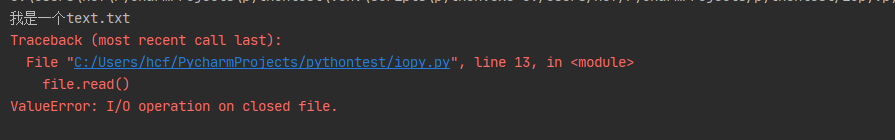

## 十一、I/O编程

> IO在计算机中指Input/Output，也就是输入和输出	[官方文档](https://docs.python.org/zh-cn/3/library/io.html)

### 1. 文件的打开和关闭

~~~python
# 打开文件并返回一个文件对象，关键字参数encoding可设置编码格式
file = open('./source/text.txt', encoding='utf-8')
# 读取文件内容 read()方法中可传入参数，设置读取字符的数量，默认是-1，读取全部
print(file.read(1024))
# 关闭文件
file.close()
~~~

`with...as`语句：

~~~python
with open('./source/text.txt', encoding='utf-8') as file:
    text = file.read()
    print(text)
file.read()
~~~

执行效果：

> 使用`with...as`语句操作的文件只能在with中使用，一旦语句结束，文件就会自动close()，不需要手动调用close()方法

### 2. 读取大文件

~~~python
with open('source/text2.txt', encoding='utf-8') as file:
    while True:
        content = file.read(1024)
        # 逐行读取
        # content = file.readline()
        # 循环读取，content为空时退出循环
        if not content:
            print('读取完毕')
            break
        print(content)
~~~

### 3. 文件的写入

~~~python
# with open('source/text.txt', 'w', encoding='utf-8') as file:
with open('source/text.txt', mode='w', encoding='utf-8') as file:
    # 可以分多次向文件写入内容，并且内容不会自动换行
    file.write('hello kitty (*^▽^*)\n')
    file.write('hello2 kitty (*^▽^*)\n')
    file.write('hello3 kitty (*^▽^*)\n')
~~~

> 使用`open()`方法打开的文件默认是只读模式，想要写入必须设置类型`mode`（第二个参数）
>
> `r`：表示只读，默认值，文件不存在会报错
>
> `w`：表示可写的，使用`w`写入文件时，如果文件不存在则会创建文件，如果文件存在则会覆盖原来文件内容
>
> `a`： 写入，如果文件存在则在末尾追加 
>
> [更多参数解析参考官网](https://docs.python.org/zh-cn/3/library/functions.html#open)

### 4. `tell()`和`seek()`

~~~python
with open('source/text2.txt', mode='rb') as file:
    # seek()修改当前读取到的位置
    file.seek(55, 0)
    # tell()当前读取到的位置
    print(file.tell())
    print(file.read(100))
~~~

> `tell()`：查看当前文件读取的位置
>
> `seek()`：修改当前文件读取的位置，参数：
>
> 1. 要切换到的位置
> 2. 计算位置的方式，可选值：0（从头计算，默认值） 1（从当前位置计算） 2（从最后计算）
>
> 注：seek()是按照字节数来定位的，utf-8下一个中文字符是三个字节，如果设置的位置无法取到一个完整的中文字符，则会报错

### 5. 文件的其他操作

~~~python
# 文件的其他操作
import os
from pprint import pprint

# 获取指定目录的目录结构，返回list。可传入一个路径参数，不传入的话默认当前目录
listdir = os.listdir()
pprint(listdir)
# 获取当前所在目录的路径
pprint(os.getcwd())
# 切换当前所在目录，相当于cd
os.chdir('c:/')
pprint(os.getcwd())
# 创建目录
os.mkdir('a')
# 删除目录
os.rmdir('a')
# 删除文件
os.remove('source/aa.txt')
# 重命名，参数可以是一个完整的路径
os.rename('source/aa.txt','source/bb.txt')
~~~

